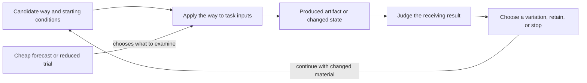
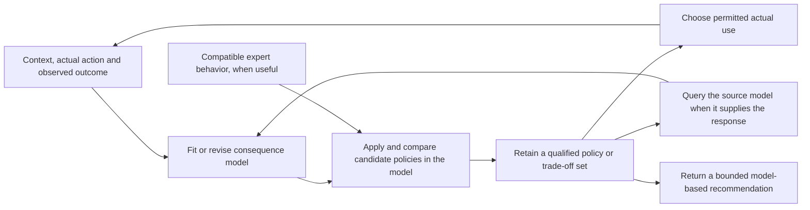

# C.40: Develop Branching Search from Reusable Material

> **Trigger:** [TODO: trigger condition — human review required]
> **Governing patterns:**
>   → [TODO: extract governing-pattern cues from body and convert to reference paths]

---

## C.40 - Develop Branching Search from Reusable Material

> **Type:** Method pattern
> **Status:** Stable
> **Normativity:** Normative unless explicitly marked informative.

### C.40:1 - Problem frame

Use this when you have something that can be developed and need to learn what a feasible variation makes possible. A sound workshop can alter its own recording; an investigation team can change a view of permitted records; a coding team can develop a working program. The eventual contribution may already be selected or remain unsettled.

The primary concern is the material being developed and the warranted continuation from an examined change. Material can be an editable construction, a working Method with its inputs, or a retained intermediate result. A promising label or score is not enough to perform the next variation.

Change something feasible, examine the resulting difference, and keep the actual material and conditions needed for a useful continuation. The first result is an examined variation with a justified continuation or stop. This transdisciplinary guidance relies on the professional operation that actually changes and examines the material.

Sections 4.5–4.12 develop conditional uses: opponents that respond to a candidate, a set of challenges whose selection changes as candidate ways improve, ways compared through the results of their application, policies developed through models of their consequences, development guided by pairwise comparisons, human contributions that change the continuing development, representations built together with their useful changes, and materially different continuations made available for further development or use. None is required for an ordinary material variation. Use C.40.CD, also reached from section 4.3, when problems and ways need development together. Ordinary variation does not require inventing a new problem. Reuse a sufficient existing result or way without entering a search. If the missing operation is how to obtain a local result at all, C.39 supplies that constructive explanation; a settled ultimate goal is not the discriminator.

### C.40:2 - Problem

Search can become an inventory of interesting possibilities without any performed development. It can also discard everything that loses today's comparison, including material that makes a useful next attempt possible.

The opposite excess is endless novelty or indiscriminate retention. A changed object, a higher score or success in a source problem does not by itself justify more work. Productive branching needs feasible operations, examination under the current question and an affordable continuation. Coupled search additionally needs validly constructed problems and target-tested transfer.

### C.40:3 - Forces

| Force | Tension |
| --- | --- |
| Present comparison versus useful continuation | A currently inferior variation may expose a useful next question. |
| Fixed contribution versus changing possibilities | The same material can be developed for today's result or before its later use is settled. |
| Diversity versus burden | Further variations, retention and recovery all consume resources. |
| Source success versus target use | A useful way may fail when the receiving conditions change. |
| Reusable material versus another person's capability | A retained artifact can be shared without transferring the skill or permission needed to use it. |

### C.40:4 - Solution

Perform a feasible change, examine what it produced, and use that result to choose a worthwhile continuation. Preserve enough of the material and its conditions to make that continuation possible.

#### C.40:4.1 - Make one small development pass

1. **Recover usable material and the local question.** Identify the actual editable or executable input and the conditions for using it. State the difference you can examine and any selected receiving contribution. Keep an original when comparison or recovery requires it.
2. **Select and perform a feasible variation.** Use the available professional operation to change, recombine or use the material differently. State what is changed and what remains protected. If the operation is unknown, use C.39 for that local contribution. When several changing operations need selection from their continuing results, use section 4.11. An unperformed variation remains a proposal with its missing prerequisite.
3. **Examine the resulting difference.** Compare what was intended with what can now be observed or otherwise established under the relevant Method. Include a useful unexpected difference. Distinguish a result that helps one question and fails another.
4. **Preserve the material needed for the justified next use.** Keep the changed artifact or result and the inputs, settings or explanation needed to continue. Retain a failed or mixed result when it changes the next question. A descriptor or favourable evaluation alone may not let another participant reproduce or develop the result.
5. **Choose continuation, retention or stop.** Ask what another attainable result could change, what producing and carrying it would cost, and what work that would displace. Continue only the branches that warrant that burden. A sufficient result or a lack of worthwhile continuation can close the search.

Several variations can share one pass when they answer the same local question and their outcomes remain distinguishable. No population size, fixed branching factor, archive, new hypothesis or exhaustive trial of every variant is required.

#### C.40:4.2 - Continue without losing the question or the material

For a selected contribution, examine variations against its requirements while retaining an intermediate result only for a stated useful continuation. A lower present score can coexist with that reason; retention does not make the variation the preferred option.

Before a receiving contribution is selected, examine a local change that is already intelligible: for example, what reversing a playable recording does, or what a complete time-ordered view exposes. A newly suggested use becomes a question to investigate, not evidence of demand or value. Stop if no continuation warrants its burden.

Preserve the actual permissions, confidentiality limits, means and participant capabilities relevant to the next use. A colleague who receives the recording or code may still lack the skill or right needed for the proposed continuation. Retaining material is different from funding further work or preserving an exercisable option.

When a single present winner is eliminating other worthwhile possibilities, section 4.12 develops the choice of useful differences, local comparison, renewed variation and actual use of the retained material. It also explains when changed observations require rebuilding that collection. A small sufficient set remains a valid result.

#### C.40:4.3 - Coupled problem-and-solution search

Enter here when problems and available ways need development together. C.40.CD supplies the full Method: recover a sought result and usable construction, form a consequential changed question, adapt the obtaining operation, examine it under target conditions, and use the outcome to choose the next question or use.

Keep the original receiving requirement connected to any narrower or exploratory problem. A partial target result may permit one useful comparison while another needed comparison remains unsupported. The next inquiry follows that remaining condition or another worthwhile use of the new construction.

Use section 4.1's material-changing and examination operations where needed. A sufficient existing answer can finish the work. B.5.QD constructs a missing question; C.39.RO constructs an operation for changed or combined use. C.40.CD connects those results through target application and preserves the conditions for a useful continuation.

When a construct's unfamiliar response must become a useful reproducible application, C.40.CU connects the needed probe, application, arrangement and receiving use. It can stop at a bounded response or conditional construction, and returns to this pattern for further worthwhile variation. Ordinary material development does not require that larger question.

#### C.40:4.4 - Use stronger claims only when they matter

A few explained variations need no formal archive or front. Use C.18 when retained exploration value, lineage, possibility-space change or a non-dominated front is claimed. That account records the relevant relations; it does not perform generation.

C.19 supplies continuation policy for a still-live search pool, while C.11 supplies a local choice. C.38 supplies comparison of complete-enough ways for one result. None converts material retention into current selection or permission to use the result.

For assurance-bearing use, identify the material, performed operation or still-proposed operation, examination basis and receiving conditions precisely enough for the claim. An observed difference, its evaluation, a proposed explanation and a claimed later effect need their own support.

#### C.40:4.5 - Develop against opponents that adapt to the current way

Use this branch when a useful way must respond to another participant's actions and a fixed collection of challenges no longer exposes its consequential weaknesses. A simulated opponent, a test generator or an authorized exercise team can search for those weaknesses. Prefer fixed representative trials when they already answer the question; maintaining adaptive opponents adds work and can reward behavior irrelevant to the receiving use.

Begin with the interaction that matters. Specify what each side can observe, when it acts, which actions are permitted, how the interaction ends and which outcomes receiving work values. Give the challenger a way to produce a meaningful difficulty within those conditions. A challenger that wins by exceeding the permitted load, seeing private future choices or exploiting a simulator error has exposed a setup defect unless that condition belongs to the intended use. Developing another participant's behavior changes the conditions faced by the candidate; it need not change what counts as a useful result.

**Build an informative first interaction.** Start with a challenge the available way can engage with, so different variations can produce distinguishable outcomes. If every attempt fails before the operation under development can act, simplify a named condition or supply the missing prerequisite. Retain the original receiving requirement while using that easier development case. Choose the challenger's objective separately from the candidate's objective: blindly negating a candidate score can reward early termination, wasted effort or another event that teaches nothing useful.

**Alternate development with an intelligible comparison.** Hold the candidate fixed while finding a permitted response that defeats or strains it. Examine the failure mechanism. Then hold a selected set of challenges fixed while changing the candidate to address that mechanism. A search algorithm, a subject specialist or a team can construct the variation; the representation and changing operation must actually permit it. Several fresh starts, different initial conditions or different allowed strategies can expose weaknesses that one continuing opponent misses. If teams participate, examine the interaction of their strategies as well as individual performance. Alternation is an affordable default, not a requirement that every interacting population update in this order.

**Keep challenges for what they reveal.** Preserve executable opponents or sufficiently complete exercise instructions, initial conditions, observation rules and meaningful failure cases. Include earlier challenges that expose different weaknesses, even when they no longer defeat the incumbent. Recheck proposed replacements against them. Sampling from a growing collection limits recurring cost, but rare failures can disappear from the sample; retain protected cases explicitly when their loss matters. Remove redundant cases only relative to the candidate set and conditions used to establish redundancy. A later way can fail on an old challenge that today's way handles, so a presently weak opponent is not universally dispensable.

**Choose on a common basis.** Compare the incumbent and proposed replacement against the same declared opponents, conditions and outcome rule. For a stochastic interaction, use enough repeated trials to distinguish a useful change from the uncertainty relevant to the decision. Keep individual outcomes or failure classes visible beside any aggregate. A weighted average answers a question about that weighting; a worst-case requirement needs its own comparison. Cyclic advantages can make different candidates useful against different opponents without providing one best candidate.

Separate success against the latest opponent from success against retained opponents. For a broader claim, examine opponents or situations not used to develop or select the candidate, such as a separately developed opponent family or a receiving-use trial. A reserve repeatedly used to select replacements becomes part of selection evidence. It is no longer an untouched final test. Broader success supports the examined family and conditions; it does not establish superiority over every possible opponent or indefinite progress.

**Use the result and revise locally.** Return the usable candidate, the challenges needed to reproduce its strengths and failures, the comparison and its limits, and the next justified use or development question. A specialist can be retained for its supported situation while a more broadly useful candidate is selected elsewhere. Include challenge construction, repeated interactions, retained material and independent examination in the cost comparison. Stop when the receiving result is sufficient, no informative permitted challenge can be obtained at worthwhile cost, or the interaction has become irrelevant to the receiving need.

If the required outcome or evaluation procedure changes, use E.23:4.1a and A.19.ECS:4.5 for the affected comparison. If only the opponent changes, rerun the candidates against a common relevant opponent set before calling the score change improvement. If the challenger defeats the task formulation rather than the candidate, return that condition to C.40.CD instead of treating impossible demands as productive pressure.

#### C.40:4.6 - Develop a set of challenges and ways of handling them

Use this branch when choosing the next challenge and finding a way to handle it need to inform one another. A fixed exercise sequence may repeat what is already easy or jump beyond every available way. Improving one candidate in one situation may also miss a construction already useful elsewhere. The result sought is a small set of worthwhile challenges with usable candidate ways, examined transfers between them, and a justified next development or receiving use.

Start from one usable challenge and the way being tried on it. Recover the challenge's inputs, required result and conditions, the candidate operation, and how an attempt can be judged. Make a small feasible variation through §4.1. Keep the original challenge and candidate available until the new comparison settles what to retain. A domain operation must supply the changed material: for example, a programmer changes an input grammar or an exercise designer changes an available tool. An instruction to generate novelty supplies neither operation.

**Choose a challenge worth developing.** Examine proposed changes on three different grounds. First, is the task meaningful and is its required result assessable? Second, is there a plausible attainable development step with the available ways and means? Third, would learning to handle this case add a consequential distinction, construction or possible use beyond what the retained cases already supply? An attractive but currently inaccessible task can be kept for a stated later question; a trivial variation can remain a regression case without receiving more development work. Use C.17 for a stronger novelty or usefulness claim, keeping its comparison basis explicit.

Estimate attainability by trying the inherited way or another inexpensive candidate. In a setting with a graded outcome, a declared band can help avoid spending all effort on trivial or wholly inaccessible cases. In another setting, use a worked partial result, known prerequisite or failure mechanism instead. Failure by current candidates establishes their limit in that attempt, not impossibility of the task. Preserve the unresolved premise when the attempt cannot distinguish inadequate means from an invalid challenge.

When task generation also creates its judge or reward, examine the connection before using the score. Recover what successful action must accomplish, whether the generated situation permits it, and what observations would distinguish accomplishment from exploiting the scoring rule. A successful execution check shows that the task runs under the checked conditions; whether its reward or success check measures the described task needs separate grounds. Use an independently grounded contrast case, a domain model or a supplied requirement for that distinction; A.19.ECS develops a missing evaluation. If no adequate ground is obtainable, keep the task and evaluation as a proposal rather than call its score success. If another task is preferred because a model calls it interesting, retain that model judgement as a selection aid and identify the human or practical reason for relying on it.

Separate three returns from this examination. If the task cannot be executed, repair its construction or discard it at the chosen effort limit. If it executes but adds no worthwhile distinction, propose another task. If it is worthwhile but not yet handled, examine the missing prerequisite, ineffective feedback or candidate limitation before making it harder. A task made easier by supplying a prerequisite can focus development on the next operation; do not credit the candidate with obtaining what the setup already supplied. A progress reward can guide attempts while a separate result condition establishes success. Both still need grounds.

When there is a fixed receiving use, compare progress on development tasks with results in that use. High local success with low receiving performance calls for a transfer or representativeness inquiry. Low local success despite adequate receiving performance can expose an unnecessary or malformed exercise. Change a named condition on that evidence and recheck the connection; automatic escalation after every success misses these alternatives. Keep representative receiving trials in view during development, and retain a separate examination for any stronger final claim. A repertoire of interesting tasks and improved performance on one receiving task are different possible results.

**Improve locally, then test useful connections.** Develop each selected way in its current challenge far enough to obtain an interpretable result. Keep unlike successful constructions and informative failures available. Try a transfer when a retained operation, artifact or starting configuration could supply a missing contribution in another challenge. Test it against that recipient's own incumbent and result conditions. Compare direct reuse first when meaningful; try a bounded adaptation when its possible benefit warrants the work. Passing the source task alone does not choose the target's replacement. When the transferred object is a description for a person, allow for acquisition, practice and support instead of assuming that copying the description transfers performance.

Use the target comparison to keep the incumbent, replace it for that use, retain several situation-specific alternatives, or return a missing contribution. A transferred result that makes a proposed challenge already easy can change the earlier decision to spend development effort there: recheck that decision after transfer. The challenge may now serve as a regression case or as a parent for another variation. Preserve its solved result even when it leaves active development.

**When one way must retain the whole repertoire.** Choose this arrangement when the receiving use needs the same candidate to handle several tasks. Continue developing that candidate across them rather than treating separately successful specialists as its combined ability. Keep earlier and current outcomes on the tasks whose retention matters, under comparable conditions. After work on a new task, examine whether the same candidate improved there, lost a previously useful result elsewhere, or merely produced a noisy fluctuation. Use repeated trials when uncertainty could change the decision, or an exact result or discriminating case when that establishes the change. A success rate near one half can reflect random difficulty without any improvement; task difficulty alone is not learning progress.

Use that comparison to choose the next development work. Return a still-needed task on which performance was lost to the training, practice or repair inputs. Include a promising new task when its possible acquisition warrants the effort, and keep enough work on the receiving use to prevent local gains from displacing it. Recently mastered tasks can receive less attention while protected comparisons still check them; a stale result needs renewed examination before it justifies omission. Interestingness can help choose among feasible acquisitions, but does not excuse losing a required old result. The mixture and frequency depend on cost, uncertainty, forgetting or regression risk and the result required; no fixed proportion applies to every use.

Perform the available learning or repair operation with those chosen tasks, then examine the changed common candidate on the affected old and new tasks and on the receiving use. Update the next allocation from that evidence. Retain the previous candidate when it is needed for comparison or recovery. If a change repeatedly trades one required result for another, investigate the conflicting requirements or the candidate's means; alternatives include a richer common operation, explicit situation-specific dispatch, or a justified narrower use. Further resampling alone supplies none of those missing constructions. Stop when the shared result is sufficient or the next acquisition and its retention burden are not worthwhile. An independently reserved final examination remains separate from cases repeatedly used to select these changes.

**Compare challenges by what matters to continuation.** A fixed task parameterization can describe relevant differences cheaply. When appearance or generator parameters miss them, examine how the same available ways perform on the tasks. A task on which one way succeeds and another fails can reveal a different opportunity from one where all behave alike. Recover the indexed ways and common evaluation conditions behind that response profile. It is relative to that repertoire: replacing a member can change which tasks look alike. Update the affected comparisons rather than treat an old descriptor as a permanent property of the task. Different generating encodings and different characterizations can serve different purposes; changing one does not automatically change the other.

**Retain enough to continue, and choose where effort stops.** Keep the task material, its evaluation grounds, the candidate way, outcomes and any adaptation needed for the useful next attempt. Preserve a failed task when its diagnosed obstacle could become tractable with another operation. Feed that obstacle and the useful differences from solved tasks into the next task proposal; a list of successful titles alone can invite repetition or another inaccessible jump. An archive of separately successful specialists does not establish that one way handles every task. Test that stronger receiving requirement with one candidate under the relevant tasks if it matters. Separate cheap retention from continued optimization; C.18 supplies stronger archive and lineage claims, and C.19 supplies a decision about funding several continuing lines. Bound the number of live tasks and the work spent trying transfers by the contribution sought and total burden. A cheaper fixed suite, direct specification or a known curriculum can finish the work when it already supplies the result.

This development need not reformulate the meaning of the receiving problem at every step. Use C.40.CD when a failed condition or new construction changes the answer that is now worth obtaining. Use §4.5 when a challenge must respond to the candidate during interaction. Keep evaluation repair under E.23:4.1a/A.19.ECS:4.5. Those returns allow one useful result to continue through a different operation without making all branches compulsory.

#### C.40:4.7 - Develop a way by what its use produces

Use this branch when the material being varied is a way of obtaining a result: a learning rule, a constructive heuristic, a training loss, a procedure with adjustable settings, or executable code. The useful difference appears only after that way has been applied. Choosing a good finished schedule and discovering a rule that makes good schedules on further inputs are different searches. A sufficient known way, direct derivation or small complete comparison can avoid the larger search.

**Construct the two connected operations.** Give the candidate a usable representation and a permitted changing operation; section 4.11 develops that connection when it is missing or obstructs a needed variation. Parameters permit tuning within a form; changing a formula, operation or connection can enlarge the forms reachable. Include a known usable incumbent. Start with variations whose application can actually be performed and examined; a larger representation is useful only if it exposes a consequential alternative at an affordable search cost. C.39 develops an unavailable obtaining operation, and C.38 compares serious complete-enough alternatives.

For each candidate, perform the obtaining operation on stated inputs, then judge the result it produced. In a learning application, this includes initialization, training and subsequent use of the trained model. In a scheduling application, it includes constructing and examining a schedule. Recover the candidate way, its starting state, the resulting artifact or state, and the outcome separately. The outer development changes the way; the inner application obtains the result used to compare ways. These are roles in this particular construction, not a universal hierarchy of Methods.

Specify which inputs the candidate may use and which observations its assessment will use. A learning rule can see training examples while its performance is assessed on other examples. Developing a reusable way across situations also needs different situations: an answer hard-coded for one task can pass that task without learning or constructing anything useful for the next one. Protect important failure classes beside any aggregate. Keep cases repeatedly used to select changes distinct from a later examination supporting a stronger receiving-use claim. Repeatedly consulting a reserve makes it selection material.

The arrows show result use and a return for development. The forecast selects work; the produced result supports the corresponding outcome claim. When the use is prediction alone, C.29 supplies that different bounded claim.

**Choose what is allowed to change together.** A useful form may require its own tuned parameters. Compare a form with parameters fitted by the allowed inner operation rather than condemn it under settings suited only to its rival. Conversely, adding adjustable parameters is not automatically an improvement. Compare fixed forms, tuned forms and changed forms where those alternatives can settle the question. State the allowed tuning work for each; count it in the development burden. If the changed form needs another initializer, data preparation or support, compare that complete arrangement and preserve the dependency in the returned way.

Changing a training loss changes what guides updates. It does not by itself change what the receiving use values. An outer comparison can favor a loss whose numerical value is larger or whose early learning is slower because the resulting model performs better in the intended use. If the evaluation itself is defective, return to A.19.ECS and E.23; optimizing the candidate against that defect is no repair. A genuine change of the receiving requirement instead reopens the affected question through C.40.CD.

**Make search affordable by choosing an explicit approximation.** First obtain enough actual applications to make the comparison intelligible. Then choose among the following arrangements according to what is costly and what evidence the decision needs. They can be combined when their combined losses remain acceptable; they are not compulsory stages.

| Arrangement | How it saves work or waiting | What must remain visible |
| --- | --- | --- |
| Restrict the representation or vary a known way | Fewer implausible constructions need testing. | A missing operation cannot be discovered inside a representation that excludes it. Reopen the representation when useful failures point outside it. |
| Use a smaller task or a shorter application | More candidates receive an initial trial. | The reduction can change their ordering. Promote promising and consequentially uncertain candidates to the receiving scale; compare there before making that scale's claim. |
| Predict the outcome from candidate features or an early trace | A fitted model selects which expensive applications to perform next. | Preserve predicted and observed outcomes separately. Feed actual outcomes back into the predictor, examine consequential errors and changed regimes, and use C.29 for its mapping and validation boundary. |
| Reuse an intermediate state | Avoid repeating work already performed. | The new way starts from inherited progress. Compare continuation from that state separately from performance when started afresh. |
| Evaluate independent candidates in parallel, using returned results before all finish | Reduce idle resources and waiting. | Faster-returning lineages may receive more opportunities. Preserve pending candidates and the conditions of each result; inspect whether altered selection or stale inputs change what is found. |

For prediction-assisted search, choose features available at the time the decision must be made. Relate them to actual completed outcomes from the relevant regime; a feature measured only after completion cannot save that completion. Fit the prediction rule, use it to propose the next costly trial, perform that trial, and update the rule with the obtained outcome. An early trace can support a forecast of later performance but can miss a late improvement. Keep a way to investigate such misses when they matter: complete a discriminating delayed case, reserve some effort for uncertain regions, or broaden the calibration data. Stop relying on the forecast for a changed regime until its relevant relation is supported.

An early stopping rule similarly rejects further work, not the possibility of eventual success. If it is calibrated only on fast learners, a repeatedly discarded slow family can remain invisible. Recheck that omission against the receiving question. A cheap filter for malformed candidates is different: it can reject a proved type error or inadmissible operation without predicting final quality. Reusing an earlier result for an equivalent candidate requires the relevant equivalence; agreement on a few sampled outputs provides only that sample's evidence.

For asynchronous evaluation, retain the identity and starting conditions of every pending candidate. Queue enough independent work to use the available workers. When a selected batch of results returns, compare those results under their applicable conditions, select material for variation, and submit replacements without discarding the still-running candidates. A small return batch permits prompt adaptation; waiting for a larger batch can reduce how strongly a few fast lineages determine the next proposals. Retain each result's task, starting state, work allowance and candidate version. Check whether older parent material or faster return changes what is selected, and refresh the material used for variation when that is the cause of lost progress. Compare resulting quality and total work as well as elapsed time before retaining the asynchronous arrangement.

**Choose a fresh-start comparison or continued development.** With independent applications, each candidate receives a defined starting condition and work allowance. This supports a claim about the candidate's way under those conditions. With continued development, a successful state can be copied or retained, its settings changed, and work resumed. This can produce a better final artifact cheaply even when the last settings would be poor from the original start. Return the trajectory or reproducible continuation, including the state and earlier operations it depends on. A separate fresh-start trial is needed only for the stronger claim that the final settings define a reusable way from that start.

For example, in a stipulated update toward a known target 10, the rule is x ← x + a(10 − x). Two updates with a=0.5 from x=0 produce 7.5. Two updates with a=0.1 from an inherited x=8 produce 8.38, but the same rule from x=0 produces only 1.9. The continuation ending at 8.38 has an error of 1.62, smaller than 2.5 for the other run; this supports that continuation. It does not show that a=0.1 is the better two-step rule from zero. Directly setting x to the already known target would be cheaper in this toy problem, so the arithmetic illustrates the comparison distinction, not a need for evolutionary search.

State reuse needs a legitimate realization. Software may permit copying model weights and compatible optimizer state. A changed structure may make that state unusable. A person's acquired skill, fatigue or experience cannot be cloned by copying instructions. For development involving people, use actual preparation and learning conditions through HCD and actual trials through ME.11. If a comparison requires identical acquired states, keep that unavailable condition explicit; copying instructions supplies no such state.

**Learn from the histories the developing way causes.** Use this construction when a learned action rule or fitted component helps determine the inputs it will encounter next. A small initial error can take it outside the histories demonstrated by a competent source. Keep a fixed dataset when it already supports the intended behavior; use a direct rule when that obtains the required response more cheaply.

Run the candidate inside the permitted interaction, retaining the observations and actions it actually causes. At a consequential reached history, obtain a teaching target from a suitable expert, source model or other qualified feedback operation. The target can be a corrected action, a distribution over continuations or a component output that supports the acting way. Pair it with the information the learner will actually receive. An observation or outcome following the old action belongs to that action; obtain the response to a corrected continuation through a new permitted application or supported model.

Fit the selected learner through CMP.7, then run the changed candidate in the interaction again. Use the new histories to obtain further needed targets, retaining relevant earlier examples and protected behavior. A changed learner changes what will be encountered; repeating the original expert demonstration alone can miss the new error. Stop when the required behavior is supported at its receiving conditions or the remaining learning no longer warrants its collection and use costs. More collected histories are useful only through the learning and later behavior they permit.

Training may use information unavailable during action, such as a simulator's hidden state, to obtain targets. Keep that information out of the learner's operating input unless it will be available there. Test whether the available history can support the required response. If indistinguishable histories require different actions, return to the observation, retained state, supported assistance or narrower use; inconsistent targets cannot repair the missing distinction. MMP.8.SD supplies that information-and-timing construction.

Check whether the teacher can supply useful targets at the learner's reached histories. If it needs adaptation, obtain several teacher continuations from a learner-produced prefix. Judge their completed outcomes with an available check, use that feedback to train the teacher on its continuations, and return the updated teacher to the learner's next training. Repeat as the learner changes when benefit warrants the cost. This requires access to change the teacher and useful outcome feedback; otherwise retain another supplier or an unsupported continuation. Improved completed outcomes do not establish correctness of every local instruction. Include data collection, target preparation, fitting and repeated interaction in the complete development comparison. A source-model trial supports that model's setting; physical or other receiving use still needs its own permitted examination.

**Return a usable discovery and its supported claim.** Keep the executable construction or sufficiently developed description, necessary initialization and support, settings or adaptation rule, outcome comparison, and consequential failures. If the sought result is the final trained artifact, return that artifact rather than claim a new reusable learning way. If a general way is sought, try it on the relevant different inputs and examine accidental dependencies on the search setup. Separate changes that preserve the computation from simplifications or decouplings whose effect needs a new comparison. Removing an apparently redundant instruction can expose a useful compact method; a component that merely looks strange may carry the improvement. Test the changed construction before replacing it.

Compare development cost, recurring use cost and time to a useful result separately. Count candidate construction, partial and full trials, tuning, repeats, prediction-model construction and updating, retained state, and the receiving examination where applicable. Fewer full trials can coexist with expensive feature collection; less waiting can coexist with more total work. Stop with a sufficient incumbent or retained conditional alternative when further improvement does not warrant that burden. Changes to task inputs, training horizon, allowable support or receiving criterion reopen only the comparisons they can invalidate.

#### C.40:4.8 - Search for a way to act through a model of its consequences

Use this branch when actual trials of many action rules are costly, slow or harmful, but an obtainable model can help select a smaller number of worthwhile candidates. The search develops a **policy**: a rule choosing an action from information available when acting. A predictor instead estimates what follows from an action in a context. Choosing the prediction with the best number is not yet constructing, performing or validating that action rule. A small direct comparison, an adequate known policy or an exact solution can finish the work without this arrangement.

**Connect the action rule to the consequence account.** Name the contexts, allowed actions, outcome meanings and receiving choice. A context contains observations or remembered information actually available before the action. Distinguish controllable settings from conditions the practitioner cannot choose. For repeated decisions, preserve the transition, observation timing, resource use and accumulated consequences through MMP.8.SD. A fixed sequence and a rule reacting to later observations can produce different results.

Write the two roles as `a = π(c)` and `o_hat = P(c,a)`. The first returns an action; the second returns a modeled outcome, distribution or bound. Give π a representation that can be applied and varied: a table, conditional procedure, rule set, parameterized function or another suitable construction. Include an incumbent whose actual operation is understood. The professional Method must supply how to perform each returned action; changing a policy description does not make new equipment, access or skill available.

Choose what P must return for the intended comparison. A one-step response can be iterated only with a sufficient update of context and relevant uncertainty. A predictor of total return already summarizes a continuation under its training conditions; repeatedly adding its outputs can double-count that return. A terminal score cannot supply an omitted trajectory constraint. For several outcomes, retain their trade-offs and any protected conditions. A penalty permits violations; an action restriction excludes them only insofar as its enforcing operation works. An aggregate improvement can conceal a loss in a particular context or for a particular affected party.

**Obtain a model for the actual use.** Recover observations as matched context, action actually taken and resulting outcome, including timing, selection, censoring and changes of regime. Train or fit P through CMP.7 and the appropriate subject modeling Method. When replacing an expensive simulator or source model, MMP.17 constructs its cheaper response and a return to that source. Preserve this distinction: agreement with a simulator supports the simulator's response, while agreement with observations addresses the modeled phenomenon. Neither automatically identifies what an untried intervention would do. Use C.28 and the corresponding subject model when that intervention claim matters.

Keep the inputs available during policy use separate from information used only for assessment. For a human or expert-generated proposal, store a proposed action separately from the action actually performed. Fit on the latter's outcome. An action chosen only in favorable conditions may appear better because of those conditions; merely adding more such records can preserve the error. Where the intervention consequence is unidentified, the useful output can remain a conditional model comparison or a question for a discriminating trial.

Assess the model where the search will use it. Compare relevant response errors, constraint crossings and ordering of serious candidate actions, not just an overall prediction average. Include withheld contexts, histories or regimes according to the claimed further use. For an iterated model, test the horizon and feedback operation as well as one-step error. Optimization can drive π toward poorly supported combinations even when P predicted historical behavior well. Restrict that use, obtain an informative source response, or retain its uncertainty; repeating the optimizer does not repair the missing relation.

**Develop and compare complete policies.** Fix a common set or distribution of contexts and a common model version for a comparison. For each candidate π, compute its actions and feed those actions with the corresponding contexts to P. In sequential use, carry the modeled state forward and apply π to the information then available; include the chosen horizon and terminal consequences. Calculate the agreed outcome profile and action costs. Retain nondominated candidates when the receiver has not selected one trade-off. C.18 supplies the stronger front and archive claims; a finite search usually returns the best alternatives found, not an exhaustive optimum.

Vary promising policies using the representation's feasible operations, and repeat within an affordable allowance. A rule for one context can be combined with a rule for another; a joint action can combine operations inside the same context. Those are different search spaces. Check their joint conditions: two separately allowed actions may share a resource or interfere. Keep a sufficient incumbent and useful diversity so that the next model update does not leave only closely related candidates. Direct enumeration is preferable when the candidate family is small enough; evolutionary variation is one obtaining mechanism for a large family, not a condition for model-assisted development.

These arrows show result use. The return through actual use is conditional on permission, feasibility and the needed evidence; a recommendation can be the current endpoint. A simulator test supplies a source-model outcome, not the observed-world data represented by D.

**Use uncertainty to change the continuation.** Decide whether the uncertain comparison warrants a source query, a limited trial, a conservative alternative or an unresolved answer. With supported response bounds, propagate them into the policy comparison. With fitted predictive distributions, compare calibration and proper scores on relevant observations and retain the population, horizon and selection conditions. A nominal interval at one fixed query is not a simultaneous guarantee over all policies searched. Common model omissions can survive an ensemble, and a narrow fitted interval can be wrong outside its supported regime.

For a retained point predictor, a residual model is one possible addition. Pair its predictions with known outcomes, form residuals `r = y − P(x)`, and fit a model for those residuals using the context and the original prediction. The corrected point is `P(x) + estimated residual mean`; the residual model supplies a conditional uncertainty account. RIO realizes this with a Gaussian process whose kernel is the sum of an input kernel and a prediction-output kernel, fitting its parameters to residual data. It leaves the original predictor unchanged. Its [primary method, §§3–5 and Algorithm 1](https://arxiv.org/pdf/1906.00588v5), supplies that numerical construction and its assumptions. A practitioner using it must distinguish uncertainty of a latent response from variation of a future observed outcome, choose the corresponding prediction, and assess the resulting intervals. Near-zero fitted training residuals do not establish small further-use error. A simpler empirical correction, a justified bound or a direct source call can be preferable.

For a multistep forecast, propagate the joint uncertainty through the actual update. Sampling a modeled next outcome and feeding it into the next step is one possible rollout; sampling independently at each step would lose a persistent shared disturbance unless that disturbance is retained. Quantiles of such rollouts summarize that model, not all possible failures of it. When the result changes a consequential action, examine the omitted dependence or regime before relying on numerical precision.

**Use expert material without pretending to transfer expertise.** This optional branch is useful when several people or existing programs already supply diverse workable policies. First agree on the input meanings, available observations, action interface and outcome comparison. Obtain their prescribed actions on contexts that expose both ordinary behavior and consequential differences. Keep permission and confidential information conditions in the collection arrangement. The submitted program or action record is reusable material; the person's capability is not copied.

When the representations are incompatible, fit each policy's behavior into a shared evolvable representation through CMP.7, or translate it exactly when the finite cases and semantics permit. Compare the original and translated actions, the resulting outcome profiles and important exceptions before using the translation as a seed. If the original uses unavailable information, repair the common inputs, keep that expert as a separate callable supplier, or preserve the failed approximation. An average imitation score cannot establish preservation of a rare safety condition. Ask the expert or the receiving use which distinctions must survive; use those in the comparison. When the learned translation changes the histories it subsequently encounters, use :4.7 to obtain and fit targets on those histories, then compare the resulting behavior again.

Seed the search with the usable translations and preserve the originals for comparison and possible return. Recombination can retain different specialists in different contexts or combine useful action parts within one context. Mutation can explore beyond the submitted behavior. A mixture that only chooses whole expert outputs cannot express every such combination; it can still be the cheaper adequate alternative. If direct translation already returns a sufficient policy, stop there. Track derivation when the receiver needs to inspect origins, but re-evaluate the child: its ancestry does not establish its behavior, safety or the causal value contributed by an expert.

**Return to use, then revise what changed.** Return an applicable policy or a qualified set, the observations it needs, its action realization, supported outcome profile, material model assumptions and fallback. A human decision maker may choose a trade-off or change an action because of a fact absent from the model. Recheck the changed action's feasibility and modeled consequences where useful. Preserve the reason for the change so that the next learning pass does not mistake it for the original recommendation.

Choose an actual trial or deployment only within its permitted conditions. Observe what was done and what followed; compare that result with the prior prediction and incumbent under the claim being tested. A failed source-model approximation returns to MMP.17; a failed account of the phenomenon returns to MMP.14 or the subject Method. A changed objective returns to the receiving choice, not automatically to retraining. If a model is revised, re-evaluate retained contenders on a common relevant basis before comparing their scores across versions. Continued policy evolution can reuse material; it cannot make the old and new scores commensurate by itself.

Count model construction, expert querying and translation, policy search, uncertainty calculations, actual trials, oversight and recurring use. Stop with a sufficient known policy, a conditional recommendation or an explicit unsupported action when the remaining search cannot justify its cost or risk. This arrangement develops policies and their consequence models together; repair of what counts as a valuable outcome remains the separate evaluation-development question under E.23 and A.19.ECS.

#### C.40:4.9 - Guide development with pairwise comparisons

Use this branch when comparing two candidates is obtainable at useful cost, while predicting each candidate's numerical outcome is unnecessary or unreliable. A workshop can compare two trial products, a computational search can learn which of two configurations its simulator favors, and an author can ask which of two explanations better serves one reader. The comparison can guide what to develop or examine next. It supplies neither an absolute outcome nor assurance that the preferred candidate is adequate. Use a small direct comparison or an already sufficient way when learning a comparator would add more work than it saves.

**Obtain the comparison the next move needs.** Fix the candidate meaning, context, criterion, judge or evaluating operation, and intended use of its answer. Comparing two complete policies under a common collection of situations differs from comparing two actions in one situation. Specify which is needed; one favorable local action does not establish a better policy. Preserve separate criteria when their trade-off is unsettled. Keep requirements for permitted trials and sufficient receiving results outside a merely relative preference.

Obtain initial comparisons from compatible existing observations, an evaluable source model or a competent judge. When numerical outcomes are available, derive the pair labels from outcomes obtained under comparable conditions and retain those outcomes for later magnitude or threshold questions. When only preference is elicited, retain whose preference, about which consequence and under what presentation. A preference is not automatically an observation of effectiveness. PSD.9 and PSD.11 supply the value and consequence account when these meanings still need work.

Distinguish a decisive preference, a supported tie, supported incomparability and an unanswered comparison. Preserve material disagreement between judges instead of treating it as repeated observations of one common preference. If presentation order may change a judge's answer, compare the pair in both orders. An inconsistent answer exposes that dependence; discarding it from a binary fit does not establish a tie or remove the missing information. Repeated agreement by the same fallible judge can leave a shared error untouched.

**Construct and examine an applicable comparator.** Represent an input as the two candidates together with the conditions that change their comparison. CMP.7 supplies an effective learning operation from the obtained labels, chosen family and fitting criterion. For a small finite family of comparison rules, evaluate each on the labelled pairs, minimize the declared classification loss and retain tied rules when their disagreement affects the next choice. A parameterized classifier instead needs its fitting procedure. MMP.17 supplies response-specific substitution and return when the labels come from an expensive source model.

Choose the output the caller can use: a predicted preference, a probability with a stated interpretation, or an unresolved relation. For a binary no-tie model, exchanging the inputs should exchange the alternatives' probabilities; enforcing this symmetry prevents one inconsistency but does not establish transitivity or accuracy. Add an explicit tie model or keep ties unresolved when they matter. A probability near one half can express uncertainty; it does not by itself establish equal outcomes.

Examine errors on the pairs and conditions the search is likely to encounter, including serious contenders and consequential exceptions. Hold out candidates, contexts or judges when the further-use claim concerns those new objects: separating pairs at random can leave the same candidates in both fitting and assessment. Check whether the learned relation remains informative after variation produces unfamiliar candidates. A classifier's confidence and overall accuracy are insufficient grounds for dropping an unexamined family.

**Turn comparisons into an explicit development choice.** A reliable transitive comparison can support ordinary sorting. An incomplete or noisy relation needs a different construction. Keep the obtained and predicted comparisons available while choosing among these useful arrangements:

- For a small set, obtain the missing decisive comparisons directly and retain an unresolved set if they cannot be obtained. Do not convert absence into a loss.
- A binary tournament can cheaply propose a parent or next trial. State how pairs and ties are chosen; with cycles, the order of encounters can change the survivor. A tournament survivor is not thereby better than every candidate.
- When a common reference set is meaningful and pair predictions are affordable, use an explicit aggregate to prioritize investigation. For a finite set S of n candidates and binary predicted win probabilities p(i,j), one such score is t(i) = sum of p(i,j) over j in S, divided by n, with p(i,i)=0. It describes modeled wins against a uniform draw from that set. Ordering these scores is transitive even when the pair predictions cycle. This creates a different ranking rule; it neither corrects the pair predictions nor recovers the outcome's magnitude.
- When comparisons themselves are costly and sparse, a fitted preference model can guide which pair to ask about next. A Bradley–Terry model assumes p(i,j)=1/(1+exp(-(u(i)-u(j)))) for a common latent score u. Obtain the scores by fitting the observed comparisons with an explicit identification constraint or prior, through CMP.7 and the chosen solver. Its transitive score structure is an assumption. A prior can produce a numerical ordering across disconnected comparison groups without supplying evidence between them.

For the aggregate construction, give every candidate the same stated reference basis. With m unknown entries in a row, treating each as ranging from zero to one yields the arithmetic interval [s/n,(s+m)/n], where s is the sum of that row's available entries. Overlapping intervals can leave the score order unresolved. These intervals describe missing entries in the proposed scoring rule, not uncertainty about the truth of its known predictions. Changing S or its sampling weights changes the question; recompute affected scores rather than call their change improvement in the candidates.

Locate the reason for a cycle. If the target is the strict order of one fixed numerical outcome, a cycle contradicts that target and calls for a data, condition or approximation repair. If different participants or genuine context-dependent preferences are being combined, a single latent ordering may be the wrong target. Retain the separate accounts or an expressly chosen collective rule. A fitted total order is not a discovery that the disagreement has disappeared. Likewise, equal aggregate scores do not establish equal outcomes.

For several criteria, compute and interpret comparisons separately before any admitted trade-off. A partial nondominance result under the modeled criteria can guide search; it cannot supply an omitted constraint or the distances used by a numerical diversity metric. Preserve different constructions or use an explicitly declared diversity rule when those distances are unavailable. A.19.CPM applies only when its declared comparator and input conditions actually hold; it does not manufacture a lawful relation from inconsistent predictions.

**Choose a real informative return and revise the comparison.** Name what the next comparison or actual trial could change: the proposed survivor, a decisive missing relation, a model failure, or the supported receiving use. Include promising candidates, disagreement and poorly covered but consequential cases according to that purpose. C.11 supplies the worthwhile local choice among feasible inquiries and current actions. Exploring every pair is unnecessary when the next decision is already supported; excluding every presently disfavored candidate can instead make a shared model error permanent.

Perform the selected comparison or permitted trial and retain what it actually supplies. Another judge answer adds evidence about that judge's preference. A source-model evaluation supplies that model's response. An observation from actual use can challenge the model of the phenomenon. Feeding the comparator its own previous predictions supplies none of these new grounds.

Add the new compatible observations to the learning material, revise the affected comparator or its target, and compare retained contenders on the same updated basis. If a source observation contradicts a prediction, preserve both the observed result and the obsolete prediction's identity rather than averaging them as equal-quality votes. If the criterion, participant or context changed, separate or reweight the old comparisons only on a stated relation to the new use. An actual change of the sought result returns to C.40.CD.

Use the chosen parent or retained set to make the next feasible variation through :4.1. A new candidate needs comparison grounds; its parent's rank is not inherited performance. Return the usable material, the supported relative result, the chosen next use and any missing absolute condition. Recognition of this branch needs only an affordable informative comparison; reliance on a learned ranking additionally needs a qualified judging or source operation, applicable learning and comparison assumptions, and evidence for the receiving claim. Stop with a sufficient result, a bounded comparative recommendation or a named unresolved condition when further work is not worthwhile. Exhausting a search budget can justify stopping work without establishing that its best-ranked candidate is sufficient.

#### C.40:4.10 - Make human contributions usable in continuing development

Use this branch when a person can recognize, demonstrate or explain something useful that the current search does not obtain affordably. The contribution may change an editable candidate, the examples used to construct it, the examination conditions or which branch deserves continuation. It must reach that particular operation. Asking for feedback and collecting comments do not by themselves change the developed material. Use a sufficient existing construction, a direct professional correction or an ordinary comparison when that finishes the work more cheaply.

**Choose a contribution the person can actually supply.** Show the candidate in a form that exposes the relevant behavior and permits a consequential response. A person who can perform an example need not be able to write a complete rule; a person who can explain one exception need not be able to implement the whole policy. Name the missing contribution and make its effect inspectable:

| Available human contribution | Make it operative | Examine the resulting continuation |
| --- | --- | --- |
| A useful demonstration | Record the observations available to the performer and the corresponding actions. Fit a candidate on those pairs, or translate the demonstrated finite cases directly. For a sequence, retain the preceding state and order that make each action meaningful. | Try the candidate from the relevant starting conditions, including departures from the demonstrated path. Reproducing supplied actions does not establish recovery after its own mistake. |
| A local rule or correction | Express its condition, action and exceptions in the candidate's executable representation. Alternatively, translate it into a compatible component and integrate that component with the existing behavior. | Check which inputs now activate it, how it interacts with other rules and what changed in actual or modeled consequences. A rule offered as a seed may subsequently be changed or discarded. |
| A more informative or approachable task | Change the environment, cases or intermediate reward while retaining the original receiving requirement. Restore omitted conditions as the candidate becomes able to handle them. | Examine transfer to the harder or original situation. An easier task that teaches a different response may offer no useful bridge; more practice on it cannot establish the missing behavior. |
| A preference among visible alternatives | Present comparable alternatives, retain whose preference was expressed and what was shown, and use the judgement to choose material or through :4.9 to obtain a supported comparison. | Return the resulting alternatives to that use. Aesthetic preference, factual accuracy and admissibility can require different examinations. |

These are alternative inputs, not successive stages. Combine them when their results support the same development. A selected demonstration can suggest a rule; a failed rule can expose a missing observation or a better training task. If the required input is unavailable to the later performer, obtain it there or change the candidate. Training cannot manufacture an unobserved fact.

**Construct a representation that supports the intended change.** For a policy, keep :4.8's context-to-action meaning and available-input boundary. When people need to inspect and change conditional behavior, an executable rule set can be a useful alternative to an opaque parameterized function. Define the input features and units, permitted conditions, actions and evaluation rule. Conditions can compare a feature with a threshold, two compatible features or a remembered value; introduce products, powers or time offsets only when their meaning and cost are understood. A small table or hand-written procedure may already express the needed behavior.

Specify what happens when several rules match and when none matches. Executing the first matching rule, selecting the strongest action and performing all matching actions are different procedures. Preserve priority, aggregation, ties and fallback when they matter. A printed coefficient called confidence can be merely an evolved decision weight; it has no calibrated probability meaning without its own basis. CMP.12 supplies execution and translation, including binding, control and the needed preservation argument; CMP.10 supplies representation choice when access and update costs matter.

Obtain a candidate by direct construction, finite enumeration or search over those admitted expressions. In a rule search, start with a usable incumbent and any compatible advice. Vary a threshold or feature, add or remove a condition, exchange whole rules, change priority or combine conditions for the same action. Combining conditions with AND narrows where that rule fires; it does not automatically combine the useful behavior of its parents. Reject malformed expressions and evaluate each child's complete behavior, including interactions and fallback. The local operations must preserve any protected conditions or return their failure; a desirable parentage cannot supply that result.

Separate a hypothesis from a requirement that later variation must preserve. Advice supplied as a mutable seed permits departure. A binding action restriction needs an effective operation that excludes prohibited outputs, a protected part of the representation or examination sufficient for the required claim. A large penalty or repeated demonstration can still permit a violating candidate. If advice conflicts with the current requirement, resolve that conflict with the responsible practitioner before treating either as a training target.

**Choose what the rule is being fitted to.** Fitting recorded outcomes answers a prediction question; matching an existing program answers a behavior-copying question; obtaining useful outcomes by acting answers a policy question. CMP.7 constructs the selected learner. For an opaque incumbent, query it on relevant inputs and fit a rule set to its returned decisions. Compare agreement with the incumbent separately from correctness against available subject evidence. Queries generated within individual feature ranges can still describe impossible joint situations; keep the query domain and later use meaningful. If original data are unavailable, the incumbent can still supply target outputs, but it supplies no independent ground truth about their quality.

Retain complexity as a separate consideration when a shorter rule set would help inspection or use. Counting conditions or penalizing their number can expose a fidelity–size trade-off. It does not measure whether a particular person understands the rules. Compare plausible simpler alternatives, and retain consequential exceptions even when they are infrequent. Removing a rule that never fired in a sample preserves that sample's answers at most; the rule may handle a legitimate unseen case. A claimed behavior-preserving simplification needs the corresponding domain argument or bounded comparison. For example, deleting a false condition from a conjunction can make a formerly impossible rule fire; it is not an innocent shortening.

**Return the behavior to the contributor and revise what changed.** Present a relevant input, the rule or construction actually used, the returned action and its supported consequence. Invite the contribution that can change the next move: correct an input meaning, supply an exception, show another action, choose a trade-off or challenge the objective. A natural-language explanation of a rule must preserve its conditions and action selection. A convincing explanation of an approximate copy is still not an explanation of every original decision.

After an edit, distinguish three returns. A change meant only to make the expression easier to read returns to preservation of behavior. A changed action rule returns to comparison of the policy and its consequences under :4.8 or direct examination. A changed purpose or valued outcome returns to the receiving question, including :4.3 when the problem and available ways now need development together. Compare the revised candidate with the retained one on the affected cases and on still-required earlier behavior. Retain a qualified improvement, repair the failed change or restore the earlier candidate. When actual use is appropriate, observe the action performed and its result; the person's approval of a displayed proposal is not that observation.

**Prepare material that permits a useful contribution.** If the initial variants are too trivial or alike for a meaningful human choice, first obtain better starting material through an available generation or variation operation, suitable reusable examples or a short assisted construction. Automatic preparation may use cheap distinctions such as novelty or structural complexity to escape a nearly uniform initial set. These measures guide preparation; they do not establish what the person values. Present a small prepared set and examine whether the person can now identify a consequential difference or make a useful continuation. If not, revise the preparation or use a simpler sufficient construction rather than spending more comparisons on the same uninformative material. When voluntary participation cannot supply this preliminary work, a bounded paid contribution may be an available alternative. Agree what it must produce and examine the result in the receiving use; payment alone does not establish suitability or shared preferences. Count this preparation and human work in the comparison of complete arrangements.

**Make continued participation affordable.** Ask for a contribution where it can change the continuation: an unresolved serious comparison, a poorly supported case, a disagreement between candidates or a failed attempted correction. Show enough context to make that response interpretable. Small distinguishable batches, recovery of an earlier version and controllable variation can let the person inspect differences without repeatedly starting over. Count the person's preparation, inspection and correction alongside computation. A fixed adequate rule, a direct question to an expert or an unassisted search can be the better complete arrangement.

When several people continue development, share the actual editable or executable material and the conditions needed to use it. Let a recipient resume from a useful intermediate result and branch for a different question while preserving the original. Different preferences need not be averaged into one objective. Usage counts, repeated playback or clicks can suggest an inquiry, but exposure, defaults and interface behavior can cause them; qualify the preference inference before using them as selection evidence. If a person becomes unavailable or fatigued, stop, use a qualified substitute at its actual scope, or return the missing contribution. A new rater or a learned proxy may change the meaning of the examination.

The useful result is an applied contribution with an examined outcome: changed material, a justified retention of earlier behavior, an improved examination or a supported choice of continuation or stop. The contribution has reached and been examined in its intended operation; a collected comment alone supplies no such result. The method can expose and test human knowledge without transferring the contributor's whole capability or making every human contribution correct.

#### C.40:4.11 - Build the representation together with its changes

Use this branch when the material's form makes a needed variation difficult or unavailable: a shared rule changes too many parts, a grammar cannot express the proposed construction, or repeated changes never leave the same family. The useful result is editable material, a way to obtain its candidate result, and changes that expose worthwhile continuations while preserving the conditions that matter. A familiar direct edit or sufficient construction can finish this work without a population search. The operation-choice construction below also applies when the representation is adequate but choosing useful changes remains costly or unreliable.

**Connect the stored material to what is examined.** Start with one current example, one consequential difference to obtain, and the properties that must survive. Follow the material through the operation that constructs or executes it to the result used in comparison. For a drawing, a parameter record drives a generator and produces a figure. For a procedure, an expression is interpreted on inputs and produces actions or another result. State the inputs, initial state and support that affect that passage. When learning or development is part of it, include that work before judging the resulting candidate. An encoded description, its constructed object and the behavior of that object have different change conditions.

Construct the simplest adequate connection. Store independently adjustable parts directly when local changes matter. Use a shared parameter or generating rule when coordinated change is useful: equality can follow from using one value twice instead of independently varying two values and repairing disagreement. Use a grammar or construction procedure when admissibility depends on how parts fit, giving its operations the bindings, input and output kinds, and stopping conditions needed to produce a usable result. Trace one production through to the result; a short description can still require expensive construction and examination. A fitted or learned generator is another possible obtaining operation, with its training and use conditions. None of these forms establishes the quality of what it produces.

**Derive changes from their intended effects.** For each important difference, identify which stored part controls it and what else that part changes. Alter that part in a copy, obtain the candidate, and inspect both the intended effect and protected properties. Start with a small change whose effects can be followed. A shared rule may be the right operation for a coordinated change and the wrong one for an exception. Add an independently controlled part or a bounded exception only when that new freedom is needed; retain the relation that keeps the remaining parts valid. For a mathematical family, construct admissible parameters and their joint conditions before choosing how to vary them. A valid parameter value and a change that stays within the valid set are separate contributions.

For recombination, decide what makes two parts corresponding and what lets a transferred part fit its receiving construction. Match by actual role, binding or retained construction history where it supplies that correspondence, rather than by an accidental position in a list. Carry the required connections with the part, resolve clashes, then construct and examine the whole child. For example, moving a conditional action requires its inputs and action meaning, not just its text. Alignment enables a meaningful combination; it does not establish a competent combined behavior. Keep an unchanged usable parent when the proposed combination still needs examination.

**Find where the useful continuation is lost.** Attempt a witness construction before enlarging the search. Can the needed result be expressed at all? If so, can allowed changes from the retained material produce it? Exhibit a sequence for the case, or a reason every permitted change preserves a relation the target violates. A finite complete traversal can establish a bounded impossibility; an unsuccessful sample cannot. If the sequence exists, ask whether it is affordable and likely to be attempted, and whether its intermediate material survives long enough to be developed. Finally, check whether the examination distinguishes the useful result. These questions locate different repairs: the representation, changes or starting material, allocation of attempts and retention, or the evaluation. Return only as far as the supported cause requires. When the cause is unresolved, compare a small discriminating case rather than declare the family incapable.

Do not infer that an intermediate candidate is useless because it first performs worse. A new component may require adjustment of its partners before its contribution appears. Give it a bounded opportunity to be tuned or keep a separate branch when the possible continuation warrants that work; specify what result would justify continuing it. This consumes resources and can still fail. Conversely, a hard admissibility condition cannot be waived merely to keep an interesting lineage. A complex construction is worth retaining only through the opportunities and results it supports; neither growth nor minimality is a universal objective.

**Change the representation without losing the needed continuation.** Identify what must carry over: a particular usable result, a family of results, the means to reconstruct them, or particular future changes. Construct the receiving material from the old one and check the required correspondence. Adding an exception with an initial neutral value can retain the old family while admitting a new difference. Expanding a shared generator into separately editable parts can enable local repair, but may lose the compact operation that changed those parts together. Keep that operation, retain the generating material, or accept the loss explicitly according to the intended continuation. If exact transfer is unavailable, retain the original and compare the consequential loss before replacing it.

Equality of current outputs is insufficient when future changes matter. Two encodings can produce the same drawing while one keeps a shared construction and the other keeps only flattened parts. They can then admit different next operations. Likewise, a temporarily inactive part can carry a future option. Retain such material for a named continuation and its affordable recovery, rather than retaining every duplicate. If the decoder or generator itself changes, re-establish what the retained inputs now produce; unchanged parameter bytes do not preserve their result automatically.

**Improve the generating arrangement only when that is the useful next change.** A collection of useful examples can support fitting a generator that proposes related material. Fit it to the selected examples, use it to construct new candidates, examine those candidates in the receiving question, and return useful outcomes to the collection. Preserve another affordable way to introduce differences that the fitted generator excludes; learning only from its own familiar outputs can confine later search. Compare the obtained continuations and total work with direct variation. When a candidate carries its own change settings or change procedure, treat those as editable material too and examine their effect through descendants. The procedure that varies material and the rule that decides what survives remain distinct even when both are implemented by one system.

**Choose changing operations by their continuing results.** Use this construction when several feasible operations can develop the material and their useful effects depend on what happens after the initial change. A sufficient fixed operation or simple fixed mixture can avoid the cost of learning another selection rule.

Decide which alternatives will share accumulated experience. Separate individual operations when their different effects matter. A group of related operations can share an estimate when examining every member separately is too costly. Keep its executable members and a rule for choosing one after the group is selected, such as uniform sampling. Retain the actual member in the trial observation so that a consequential difference can later separate the group. Splitting an operation by context is another construction; use a context available before choice and enough relevant trials to support the distinction. More categories can leave each estimate too poorly supported to improve the next choice.

Specify what one trial includes: starting material, operation and settings, allowed subsequent tuning, examination conditions, and the outcome available when that allowance ends. A structural change may need its new parameters or partners adjusted. Compare it after the allowed development, retaining its intermediate state while the result is pending. Keep an immediate observation separate from the later result. A completed unsuccessful trial, unfinished work and an inadmissible change call for different responses.

Associate each completed result with that operation and its starting and continuation conditions. Choose the useful response measure: for example, improvement from the parent at a common work allowance. A high child score alone can reward an operator for receiving an already good parent. When later refinement updates the same trial, replace its earlier provisional observation or account for the added contribution; do not count repeated observations of one developing candidate as independent completed trials. This association guides further development without isolating the operator's causal effect from its partners and continuation.

Give the eligible alternatives affordable initial exposure, then use an explicit rule to select the next operation and update its comparison after examination. For a comparable numerical gain, one simple arrangement keeps the mean completed gain of each alternative, whether an operation or a group. For each proposal, with probability 1/4 it samples an eligible alternative uniformly; otherwise it uses the largest mean, resolving ties by a stated fixed rule. Execute the operation, choosing its member first when a group was selected. When a completed trial has gain g and that alternative has n earlier completed trials with mean m, set its mean to `(n*m + g)/(n+1)` and increase n by one. This is a usable heuristic, not an optimal allocation or a guarantee that a rare useful operation will receive enough trials. Its exploration share and trial allowance must fit the actual search; a large repertoire can exhaust the budget before its members become distinguishable. Other supported selection procedures can replace it without changing the trial-to-result connection.

Reconsider those estimates when parent material, representation, tuning opportunity, group membership, member-selection rule or examination conditions change. Use relevant recent trials or keep distinct comparisons when they answer different conditions; an old average is not automatically useful in a new regime. Remove an unavailable operation from the current eligible set; repair the affected representation or operation if its capability is still needed. Compare the adaptive arrangement with the fixed alternative by the receiving result and total development cost. More promising proposals or more test-passing variants can leave the useful final results unchanged. Continue only while the additional selection and examination work earns its place.

A generator that uses the current input or state can produce different structures during use. Preserve those inputs and the relevant state/reset conditions in the candidate; a single generated structure is not a complete substitute for that way of producing it. Count repeated generation, interpretation, learning and examination when comparing cost. Fewer stored parameters need not make the complete arrangement cheaper.

Return the current material with its construction or execution means, the supported changes, the protected properties, and the grounds for the next use or stop. Section 4.7 supplies comparison through actual application when the material is a way of obtaining results. The assurance needed for a stronger preservation or reachability claim depends on the receiving use: a proof, exhaustive finite examination and selected trials establish different scopes. If the real obstacle is an unavailable observation, operation, permission or capability, obtain that contribution or change the proposal; a richer encoding cannot supply it by itself.

#### C.40:4.12 - Develop and use materially different continuations

Use this branch when improving one kind of result is eliminating other worthwhile possibilities, or when retained variants still provide no usable next action. The result is material that supports different examined uses or further development, together with the operation that makes those differences usable. Start with a few explained variants when that is enough. Maintaining a large collection, measuring novelty or building an ensemble adds work and needs its own reason.

**Choose which differences to preserve.** Begin with the use that requires alternatives: handling different situations, exploring ways whose eventual use is unsettled, preserving an intermediate construction, or combining complementary behavior. Recover the conditions and observations that make a difference consequential. Two implementations can produce the same behavior now yet permit different future changes. Conversely, very different encodings can produce the same behavior. Describe the property that matters at the point where the next operation uses it; inspect actual applications when the property depends on their outcome. C.17 supplies a qualified characterization, and :4.11 supplies the connection between representation and available change.

For example, an image's encoded byte length need not distinguish the visual forms the designer wants to retain. A controller's parameter distance need not distinguish its responses in the situations that matter. A behavior observed on one input supplies that case; it cannot characterize unseen situations by itself. Use trajectories, responses to selected inputs or another obtainable observation when the receiving difference requires them. Retain a consequential rare failure beside an aggregate. If the chosen observations cannot expose the difference, change that examination before using its score to protect diversity.

Then choose how much variety to keep and how to compare like with like. A few named kinds can suffice. A grid over descriptors is useful when its cells distinguish relevant behavior and its resolution is affordable. A distance-based neighborhood can avoid a rigid grid but needs a distance and scale that express the intended similarity. Adding coordinates or finer cells can multiply the material and examination needed without changing a useful choice. Empty regions remain unproduced regions unless a separate argument establishes impossibility.

Compare keeping separate ways with one way that takes the relevant condition as an input and produces an adequate response. A parameterized construction, a goal-conditioned controller or direct enumeration may answer the same need with less retained material. Include its training, planning, observation and use costs. The smaller description is a saving only if that complete arrangement supplies the required differences.

**Connect production, local comparison and renewed use.** When local competition is worthwhile, construct the following loop with the available professional operations:

1. Obtain initial feasible candidates and retain their actual editable or executable material. Include a sufficient incumbent when one exists. State the behavior distinctions, comparison conditions and quality criterion used in this pass.
2. Select retained material and perform a permitted variation or recombination. Selection can draw from another behavior group: useful changes need not remain in their parent's group. If no existing material can support the attempt, obtain another feasible starting candidate.
3. Apply or inspect the new candidate to establish its behavior and quality on the declared basis. Assign its group from that result. A requested descriptor is a target for generation, not an observed descriptor.
4. For an empty relevant group, retain a usable candidate. For an occupied group, compare with the incumbent there and replace it only when the resulting retained set better serves the declared use. Protect essential conditions and material needed for another continuation. In the simple one-winner arrangement, retain the better local candidate and resolve ties without pretending that equal scores establish interchangeability.
5. Use the retained material to choose the next variation, actual application, reexamination or stop. Keep enough construction, inputs and conditions for that chosen operation to be performed.

This is the useful connection in a MAP-Elites-style construction. A higher global score no longer expels every other kind of behavior. The group's winner remains the best retained candidate under that comparison, with its stated limits. The [original MAP-Elites algorithm, §3](https://arxiv.org/pdf/1504.04909), supplies that particular grid arrangement. The same receiving question can warrant neighborhoods, several retained candidates or a direct small set instead.

Selecting parents and retaining results answer different questions. Uniform parent selection gives each retained candidate an opportunity but dilutes that opportunity as the collection grows. Bias toward parents whose recent variations improved the collection can focus work, but that success depends on the current collection and attempted operators. Preserve an affordable way to examine an uncertain region when its possible continuation matters. Retention alone supplies no opportunity if a parent is never selected or all its descendants are filtered out.

**Preserve exploration without confusing it with present quality.** A low-scoring intermediate may support a useful later change. Protect its actual material and a bounded opportunity to investigate that continuation. When the eventual use is unsettled, the reason can be an intelligible exploratory question about a region or kind of behavior; it need not assert the value of a particular unknown descendant. Stop when the question no longer warrants its burden.

Novelty-guided search instead favors behaviors different from a declared reference set, which can include the current population and selected history. Specify what observation, distance and reference update make the difference meaningful. Recompute a novelty judgement when its reference changes. A history used to guide exploration can need different retention from the compact collection returned for use. Local quality comparison may be combined with novelty, but maximizing novelty alone supplies no quality guarantee.

Crowding control and separated subpopulations are other ways to limit premature concentration. Their effect depends on the similarity account, opportunities for variation and exchange between groups. A rule that repeatedly replaces a boundary candidate with a slightly better neighbor nearer the center can erode the very range being preserved. Examine the resulting collection, not only each replacement's score. If a promising path is lost, distinguish an unavailable change, an early filter, parent neglect and a retention rule that removes its intermediate. Repair that connection rather than merely increasing the number of attempts. Sections 4.7 and 4.11 develop those returns.

When a population has become too similar to provide useful further variations, restarting around a retained useful result can reopen the search. Preserve that result as a fixed base and construct a fresh population of permitted changes relative to it. For numerical material, obtain each candidate as base plus change, then examine the resulting candidate; a small change value is not itself a good result. Include the unchanged base for comparison and choose the range of changes for the question, with a way to explore beyond small adjustments when useful. After a justified improvement, save the resulting material as the new base before another restart. For other material, supply the actual edit-application operation instead of assuming numerical addition. This delta-coding construction can restore variation; it cannot repair an unavailable operation, uninformative evaluation or an exhausted useful question. Compare it with an independent fresh start, a different representation and stopping.

**Reexamine the collection when its basis changes.** Chance can affect both quality and which behavior is observed. One lucky trial can then create a false local winner or apparent coverage. Choose the further observations that could change the retention or use decision and reserve enough effort for them. Keep evidence for the actual candidate and conditions. Expected performance and repeatability are different receiving requirements; a mean score cannot settle both.

When reexamination changes a candidate's descriptor, withdraw its old current membership, update its supported characterization and place it under the current retention rule. Reconcile any collision with another candidate. Retain the old observation as history when useful, rather than counting it as an additional currently supported behavior. Temporary alternatives within a group can preserve a fallback when an apparent winner fails. Their carrying and rechecking costs count alongside new trials. Repeated observations improve the stated estimate; they do not remove a shared measurement defect or establish behavior in an unexamined regime.

A revised descriptor or learned representation creates a related return. Keep the material and observations needed to characterize retained candidates on the new basis; recompute their descriptors and rebuild the affected grouping and comparison. Merely changing the threshold for future additions leaves old members under old conditions. If the required observation was never retained and cannot be recovered, mark that part unresolved or examine the candidate again. A rearranged map alone is no new behavior or coverage achievement. Keep a means to explore beyond the regularities in the material used to learn the descriptor or generator.

**Make the retained difference available to the next operation.** Select the actual receiving branch:

- For a choice among alternatives, return the relevant candidates, their differences and supported conditions; make the receiving choice through its own Method. C.18 supplies an archive or front claim when required. C.19 supplies policy for continuing, retaining, narrowing or retiring live lines.
- For another generation, supply the retained construction and the changing operation. Preserve relationships the next change needs. If two binary choices must sum to one, independently sampling them from the previously useful pairs (0,1) and (1,0) can produce inadmissible (0,0) or (1,1). Sampling a whole pair preserves that known relation; producing a useful new combination requires a further relation-preserving operation. A learned generator similarly needs its actual fitting and generation Method through :4.11, followed by examination of its proposals. Using more historical material can reduce one loss while increasing fitting, storage and stale-condition costs.
- For one combined way, construct how the components receive inputs and how their outputs produce an action. A vote, numerical average, selection rule and combination of action parts are different operations. Check the resulting behavior: averaging two actions that pass on opposite sides of an obstacle can send the combined action into it. Train or develop a selector through :4.7 when its rule is not already obtainable, then compare the complete arrangement with a sufficient single way under common conditions.
- For learning from retained behavior, supply the relevant situation, actual action and outcome, the rule for selecting useful examples, and an available learning operation. A weak overall performer can supply an excellent local example. The recipient still needs the observations, action meanings and capability to learn from it. Apply the operation and examine the recipient's resulting behavior. Sections 4.8 and 4.10 preserve the additional conditions for expert and human contributions; a transmitted example does not itself transfer a capability.

When learning is part of a candidate's examination, choose what goes into subsequent candidates. One arrangement uses performance after learning to select the original inherited material: descendants constructed from it still need their own learning operation. Another writes compatible acquired changes into the material that descendants inherit, such as trained weights in an editable network encoding. Preserve the original, learned state and inherited material distinctly, and perform the chosen copying or reconstruction. A learned state that cannot be encoded there requires another construction. Section 4.7 supplies the fresh-start and continued-state comparisons; include the learning needed by descendants rather than crediting them with the parent's acquired performance before they can produce it.

For a combined stateful way, follow the history actually performed. A component that was idle may have stale state; one updated on its own imagined actions may have the wrong history. Supply the real history or a supported state transfer, redesign the component to use available state, or retain the resulting gap. Reinitialization is sufficient only when it preserves the intended use. Test the switching and combined trajectory, not merely each component used alone. Availability of the selector's inputs at the moment of action is part of this construction.

If the components themselves need further development, use their participation in complete ways to guide it. Assemble compatible combinations, perform and judge each whole, and associate its outcome with the participating versions, partners and connection. Compare a proposed component change with the incumbent in common relevant combinations; try other partners when a complementarity question warrants it. A component that performs poorly alone can be useful in such a combination. Conversely, a better isolated component can make the whole worse. An average over its sampled participations is evidence for those combinations, not an intrinsic value or an isolated causal contribution. Reexamine the affected wholes when partners or the selector change. This feedback can favor complementary parts, but does not guarantee that diversity will maintain itself.

Return the material and supported continuation, including a sufficient direct answer when the larger arrangement adds no worthwhile result. Count generation, repeated examination, learning or selector development, storage, recovery and recurring use. Retiring active development can leave inexpensive useful material retained; an obsolete or unaffordable continuation can justify retiring that retention too. The difference made in practice is that a developer can reproduce how useful alternatives survive, how they are used again and which connection a changed condition reopens.

### C.40:5 - Archetypal Grounding

#### C.40:5.1 - Develop a recording with or without a composition in view

A constructed workshop has a permitted 100 ms percussion clip, a qualified editor operation for reversing it and playback suitable for examining the resulting sound. The original and editable copy are available. The exercise protects the sample format and permits modification for this workshop.

The practitioner reverses a copy, plays both versions and inspects their envelopes. In the supplied observations, the original has a sharp early peak near 10 ms; the reversal swells toward a peak near 90 ms. The changed recording and reversal setting, rather than the description “interesting sound”, are the reusable result.

If the selected purpose is a sharply marked beat, the reversal fails that immediate use. The workshop can still retain it cheaply for a specified next attempt at a swelling transition; it need not call it the better beat. If no composition is selected, the same examined change can support a question about transition material. It establishes no audience demand or future musical success.

For a target requiring a peak within the first 20 ms, the unchanged reversal fails. Trimming or otherwise adapting it is a new performed operation to examine against the target's duration and sound requirements, not a successful transfer by assertion. If a qualified existing clip already meets the target, use it. Another participant needs the file, its usable settings and the capability and permission for the next operation.

The observations and resources in this case are stipulated teaching inputs. They demonstrate the distinctions, not a field test of the search Method.

#### C.40:5.2 - Develop an investigation view

A constructed investigation uses six separately permitted synthetic records and a supplied specialist rule that admits comparisons within the same known setup. An available operation groups those records and can report unmatched cases:

| Case | Outcome | Setup | Time |
| --- | --- | --- | --- |
| E1 | Error | S1 | 09:00 |
| N1 | Acceptable | S1 | 09:05 |
| E3 | Error | Unknown | 09:40 |
| E2 | Error | S2 | 10:00 |
| N2 | Acceptable | S2 | 10:05 |
| N3 | Acceptable | Unknown | 11:15 |

A matched-pair view returns E1–N1 and E2–N2. A performed output variation also retains E3 and N3 with their times and missing-reference flags. Its additional review burden is five minutes in the supplied estimate. Retaining that small output is worthwhile for the specific next question of whether setup records at 09:40 and 11:15 can recover the missing conditions. It has not diagnosed the errors.

If the receiving contribution is unsettled, a complete time-ordered view supplies another small pass: it exposes one unmatched case between the known setups and one after the last known setup. An operator-support use suggested by that result still needs a recipient and need inquiry. The local examination does not have to wait for that answer.

#### C.40:5.3 - Let a mixed transfer change the target question

A target investigation requires comparison cases to share both setup and temperature regime. A source operation groups by setup alone. C.40.CD:5.1 carries the complete four-record case and the changed construction.

The original grouping returns T1–T2 and T3–T4. The target's temperature condition rejects T1–T2. Adding temperature to the grouping retains T3–T4 for S2/warm and leaves no eligible S1 pair.

The result supports the narrower S2 comparison if useful. An S1 explanation needs comparable cases or a revised question; repeating the old grouping leaves that gap. The source operation retains its earlier qualified uses. The grouping establishes comparison eligibility, with causal explanation remaining a separate question.

#### C.40:5.4 - An adaptive challenge changes an inspection procedure

This constructed model develops a procedure for inspecting experimental coupons. It is not a production safety rule. A coupon can have a surface defect S or an internal bond defect B. A supplied ideal test A detects S and a supplied ideal test B detects B; neither detects the other defect, and neither rejects a sound coupon. Each test consumes the coupon, so the development budget permits one test per coupon. The provisional aim is a detection probability of at least 0.45 for each admitted defect class, rather than a high average over an unspecified mixture.

The challenge generator prepares a defective coupon after seeing the inspection procedure but before seeing its private random draw. Its permitted responses are S and B. In a physical exercise, specialists would have to make and verify those defects and establish test sensitivity; here those facts are stipulated. The generator seeks the lower detection probability. It may not change a coupon after inspection or invent a defect outside the stated classes.

Start with procedure P-A, which always uses A. A generator producing S yields detection 1. Letting the generator respond to P-A produces B, with detection 0. Changing the procedure to P-B, which always uses B, repairs the latest failure, but a generator now choosing S defeats it. Keeping only the newest challenge makes this oscillation look like repeated improvement.

Retain both responses and compare on those same columns:

| Candidate inspection procedure | Detection on S | Detection on B | Tests per coupon | Meets the provisional per-class aim? |
| --- | --- | --- | --- | --- |
| P-A: always A | 1 | 0 | 1 | No |
| P-B: always B | 0 | 1 | 1 | No |
| P-M: privately choose A or B with equal probability | 0.5 | 0.5 | 1 | Yes, in this model |

The new operation is a private random choice before the test. If A is chosen with probability p, detection is p on S and 1-p on B. Their minimum cannot exceed 0.5 and reaches 0.5 at p=0.5. Thus P-M maximizes worst-class detection among these randomized one-test procedures. This argument supplies the model result; a short lucky run would not establish the probabilities of real tests. An equal-mixture average is 0.5 for all three procedures and would conceal the difference that matters here.

The adaptive search produced two failure witnesses and led to a revised procedure. Once the complete two-class model is known, direct enumeration and the argument above are cheaper than maintaining an evolving population. Retain S and B as distinct regression challenges and retain P-A and P-B only if their single-class uses or construction history warrant it. A physical adoption decision still needs independently prepared specimens, sound controls, actual test sensitivity, costs and evidence about the receiving defect population. Passing those trials would remain bounded to their conditions.

Now change the information available to the generator: it can observe the selected test before preparing the coupon. It can choose B after A and S after B. P-M's detection then becomes 0, even though its unchanged old table still says 0.5. The failed premise is the timing and privacy of the choice. Restoring that separation could restore the model result; if the receiving process cannot provide it, P-M has no supported fit there. Merely adding more copies of old S and B outcomes does not repair the interaction.

A different change admits a third defect C, detectable only by a third destructive test C. Under a single-test budget, the three selection probabilities sum to 1, so at least one class has detection at most 1/3. The original 0.45 per-class aim is now unattainable in this model. The next question concerns another testing operation, additional independently testable specimens, or an authorized change of the aim. It is not another round of replacing the current winner. Earlier two-class evidence remains valid within its old scope.

#### C.40:5.5 - Transfer a parsing repair and reconsider which task is informative

A publisher develops a checker for a miniature link format. A link is a filename, one literal `#`, and an exact anchor. The rule is to split at the first literal separator, percent-decode the filename once, then look up the decoded filename and anchor in an independently supplied complete catalogue. The catalogue contains `guide.md`/`intro`, `Guide One.md`/`intro`, `C# notes.md`/`usage` and `C%23 notes.md`/`archive`. Directories, external URLs and encoded anchors are outside this model.

Prepare four challenges. Each contains the valid link below and a second link with the same path and anchor `missing`. Correctly accepting the first and rejecting the second gives two correct decisions. The catalogue, rather than the candidate's output, determines the answers.

| Challenge | Valid link | A: split, no decoding | B: decode whole link once, then split | C: split, decode filename once | D: split, decode filename twice |
| --- | --- | --- | --- | --- | --- |
| Plain | `guide.md#intro` | 2 | 2 | 2 | 2 |
| Space | `Guide%20One.md#intro` | 1 | 2 | 2 | 2 |
| Hash | `C%23%20notes.md#usage` | 1 | 1 | 2 | 2 |
| Percent | `C%2523%20notes.md#archive` | 1 | 2 | 2 | 1 |

These are exact results of the stipulated parsing operations on the eight inputs, not measurements on a production manual. Rejecting every link scores only one on each challenge; the valid/invalid pair prevents that shortcut from looking successful.

Suppose Space is being developed from A while Hash is being developed from B. Both incumbents score one. Inspecting Hash explains B's failure: decoding first creates a `#` inside the filename, and splitting there changes the target. The programmer constructs C by moving the split before the single decoding operation. Hash now scores two. Test C directly on Space; it also scores two and can replace A there without another independent repair. That target test, not the Hash result, supports the replacement.

A proposed new Plain challenge is already solved and adds no needed distinction, so keep it only if its regression use is worthwhile. Percent is also solved by C. That success can remove it from active repair, but deleting the case altogether would lose a useful distinction: the plausible repeated-normalization variation D fails on it. Retain Percent when such a variation is a live possibility.

The response profiles also explain how the comparison basis changes. Under A, B and C, Space and Percent both have profile `(1, 2, 2)`. That profile alone cannot distinguish them. Including D changes their profiles to `(1, 2, 2, 2)` and `(1, 2, 2, 1)`. The tasks did not change; the set of tried operations did. Recompute that comparison and retain the difference where it affects further development. Surface novelty such as another filename would not necessarily reveal this distinction.

Now suppose one shared checker C must handle all four challenges, and a proposed change produces D. Retaining C as a specialist elsewhere does not make the changed common checker adequate. Rerun the common checker on the retained tasks: Percent falls from two correct decisions to one while the other three stay at two. That exact counterexample establishes a regression without a noisy-rate estimate. Return Percent to the repair inputs, restore single decoding and rerun the four challenges before replacing the common checker. If restoring it prevents a required new use, identify that conflict and construct another operation instead of alternating two inadequate releases. This demonstrates the shared-candidate return for a software repair; it does not demonstrate learning dynamics or an effective training mixture.

For this fully specified small grammar, directly implementing C and retaining the four discriminating challenges is sufficient. A population of parsers and an automatic task generator would add burden without supplying a missing answer. The construction nevertheless explains what a larger search would have to connect: independently assessable tasks, informative variation, local repair, target-tested reuse and reconsideration of retained challenges. If the catalogue becomes incomplete, a larger search over these same binary answers supplies no missing target fact; return that information condition through C.40.CD. If the grammar changes, reconsider the affected rules and challenges while preserving results within the original scope.

#### C.40:5.6 - Develop a scheduling rule rather than one schedule

A constructed workshop model has one machine, all jobs available at time zero, no interruptions or setup times, and known processing times p and due times d. For an order, completion time is the cumulative processing time; total tardiness is the sum of max(0, completion − d). Lower total tardiness is the receiving criterion. These are stipulated teaching conditions, not an operations recommendation or measured workplace effect.

The material under development is a rule that constructs an order from job data. Two executable incumbents are S, shortest processing time first, and E, earliest due time first; ties use job number. A third candidate H uses S if any job has p > d, otherwise E. This condition can be evaluated on new inputs, unlike retaining a literal order for one job set. The outer development proposes a rule; each inner application sorts the supplied jobs, computes completion times and returns an order plus total tardiness.

| Input set: jobs 1, 2, 3 as (p, d) | S: order; tardiness | E: order; tardiness | H: order; tardiness |
| --- | --- | --- | --- |
| A: (1,10), (4,4), (2,7) | 1,3,2; 3 | 2,3,1; 0 | 2,3,1; 0 |
| B: (5,5), (1,6), (1,7) | 2,3,1; 2 | 1,2,3; 0 | 1,2,3; 0 |
| C: (5,1), (1,3), (1,4) | 2,3,1; 6 | 1,2,3; 10 | 2,3,1; 6 |

On A, S completes jobs at times 1, 3 and 7; only job 2 is late, by 3. E completes them at 4, 6 and 7, with none late. On C, E's individual tardiness values are 4, 3 and 3; S's are 0, 0 and 6. Across equally weighted A–C, the mean totals are 11/3 for S, 10/3 for E and 2 for H. Thus H is the best of these three on this selection set. No search over an unspecified larger space or evidence about future workloads follows.

Now apply the selected H to a previously unused set D: (4,3), (1,4), (2,7). Its p > d condition selects S, giving order 2,3,1, completion times 1,3,7 and tardiness 4. E gives order 1,2,3, completion times 4,5,7 and tardiness 2. The earlier improvement did not transfer. Once D is used to repair H, it is part of development, not an untouched final examination.

Inspect the failed condition: knowing that one job must already be late does not establish which ordering minimizes total tardiness. A feasible repair Q constructs both S and E orders, computes their total tardiness with the supplied model, and returns the better order, choosing E on a tie. Q returns totals 0, 0, 6 and 2 on A–D. It costs two order constructions and comparisons per use. Its result is guaranteed to be no worse than either supplied order under this model, because it compares those same two exact values. It is not a globally optimal scheduling rule for all inputs. A complete enumeration of the six orders is another affordable alternative for three jobs and can settle each of these cases directly; a larger population search is unnecessary here.

Suppose search is accelerated by judging only jobs completed by time 3. On A, S has completed two jobs and E none, but the final tardiness comparison favors E. That cheap progress signal cannot replace the receiving criterion. It may select trials only with a justified relation to final outcomes and a return when ordering reverses. In this small model the full calculation is cheaper than developing such a predictor. In an expensive simulator, the same distinction can justify a calibrated predictor and occasional complete trials instead.

If actual execution has already completed job 1, Q cannot select an order that places another job before it. A continuation comparison must hold that performed prefix fixed and order only the remaining jobs. It answers a different question from starting the rule at time zero. If processing times become uncertain or depend on order, the exact calculation above no longer supplies the receiving result; obtain an adequate scheduling model and trial basis before selecting on its predictions. Preserve the deterministic result within its original conditions.

#### C.40:5.7 - A discovered learning component depends on how it was trained

A neural-network developer can vary the formula used during training while keeping the receiving question about the resulting model. In TaylorGLO, a vector specifies a polynomial training loss; each trial trains a model with that loss, and validation accuracy guides the outer search. The vector's own loss value is not the outcome compared across candidates. Short training makes initial trials cheaper, while later full training examines the selected result. The polynomial representation supplies a particular smooth search space, not every possible learning rule.

PANGAEA makes a different coupled choice: evolution changes an activation function's computational form, while gradient training adjusts parameters within that form along with the network. Returning only the form and omitting its parameter initialization and training changes the proposed application. Its source comparisons include fixed functions and parameterized functions, with transfers that succeed on some architectures and fail on others. This makes fitting a complete candidate and checking its receiving architecture consequential operations.

EPBT instead continues partially trained models while changing settings and training loss. Its selected final model carries earlier training history. Treat that as a continued-development result; replaying only the final loss from a fresh initialization is a new test. AQuaSurF selects expensive activation trials with a fitted predictor based on function behavior and network-derived features, then updates from evaluated outcomes. Constructing those features also costs computation. These alternative realizations of §4.7 differ in what they vary, what they retain and what their evaluation costs. The linked primary sources in §11 supply their neural mechanisms; the scheduling construction shows what can be retained without those mechanisms.

#### C.40:5.8 - Combine processing rules, expose an interaction and revise the policy

A constructed document-processing service chooses between two optional operations: a preflight check P and an alternate parser R. Context S denotes a standard template; F denotes a fragile template. The template type is known before processing. Each row below describes a 100-document test batch with reference answers. Time includes the selected operations; errors are remaining incorrect records. The two context types have equal weight in this illustrative comparison. The numbers are stipulated test results, not measured production performance.

| Context | Action | Minutes | Errors per 100 documents |
| --- | --- | ---: | ---: |
| S | Neither | 10 | 8 |
| S | P | 14 | 4 |
| S | R | 16 | 5 |
| S | P and R | 20 | 1 |
| F | Neither | 12 | 20 |
| F | P | 17 | 15 |
| F | R | 20 | 8 |
| F | P and R | 25 | Initially untested |

The receiver seeks mean time at most 20 minutes and mean errors at most 5 for the two test contexts. These are conjunctive requirements, not weights in one score. Expert A recommends P in either context; expert B recommends R in either context. Query both at S and F and represent each as a two-row action table. Here that translation is exact for the entire declared finite context set. A real expert's behavior outside that set has not been captured.

The first model keeps the measured times and estimates the missing F interaction by adding the separate error reductions. P reduces F errors by 5 and R by 12, so the additive prediction for both is `20−5−12=3`. The same construction gives `8−4−3=1` for S, agreeing with its observed joint case. Agreement at S motivates a candidate assumption for F; it does not establish it.

A policy chooses one action at S and one at F. There are only 16 such policies, so enumerate them; an evolutionary algorithm would add needless overhead here. The enumeration expresses the same representational choices a larger search must make: combine specialists across contexts, combine operations within a context, and compare the resulting whole. Five useful candidates are:

| Policy: action at S; action at F | Mean minutes | Mean errors under the first model |
| --- | ---: | ---: |
| A: P; P | 15.5 | 9.5 |
| B: R; R | 18 | 6.5 |
| C: P; R | 17 | 6 |
| D: P; P and R | 19.5 | 3.5 |
| E: P and R; R | 20 | 4.5 |

C improves both measures relative to B by combining the experts across contexts. Neither selection of A nor selection of B as one unchanged whole obtains C. D adds an untested within-context combination. Under the first model D meets both requirements and dominates E, so it is the tempting selection. The useful next inquiry is the missing F joint response; more precise arithmetic on the additive model cannot settle it.

Suppose the permitted test of P and R on the F batch returns 13 errors. Inspection shows that preflight's rewrites disrupt this alternate parser's handling of the fragile template. The additive prediction missed an interaction of `13−3=10` errors. Add that interaction for F while retaining the already established S responses. D now has `(4+13)/2=8.5` mean errors at 19.5 minutes and is dominated by C's 6 at 17 minutes. E, whose two component responses were already tested, meets the requirements at 20 minutes and 4.5 errors. Re-enumeration of the 16 policies shows E is the only one meeting both stated limits. Return E for these batches, with the type-dependent rule and the source test; do not call this production effectiveness or a learned general law of parser interaction.

A direct test of all eight context/action combinations would also have been inexpensive in this toy setting. The surrogate is useful here for exposing where prediction-guided selection needs a return, not for claiming an economic saving. In a large processing family, test cost, the number of context/action combinations and the consequences of a miss can favor different mixtures of modeling and direct trials.

Now suppose template type will not be observable until after the action has been selected. E cannot be applied as written. If the available policy must choose one fixed action for both contexts, neither P, R, both nor neither meets both limits: their respective mean pairs are `(15.5,9.5)`, `(18,6.5)`, `(22.5,7)` and `(11,14)`. With no permitted extra observation or changed processing operation, return the unmet requirement. The change invalidates the policy's information condition, not the earlier batch measurements. MMP.8 supplies the information-dependent choice; obtaining a timely type check is a new practical contribution to compare with relaxing a limit or changing the service.

#### C.40:5.9 - Preserve the receiving claim in land-use prescription

In the source application of [Young and colleagues (2025)](https://doi.org/10.1017/eds.2025.18), the predictor approximates long-term committed carbon emissions supplied by the BLUE model, using land-use and geographical inputs. A prescriptor maps a cell's context to a new allocation. Its output construction protects primary land and urban area while redistributing the allowed land fractions with their total preserved. Search compares predicted carbon with the fraction of land changed, a proxy for disruption. It returns trade-offs for a decision maker rather than one independently justified social optimum.

The model choice matters to that search. The reported global random forest has lower ordinary test error than the global neural network, but the network is chosen for behavior on larger land-use changes beyond ordinary cases. The paper examines those changes against BLUE qualitatively; this is not a general extrapolation guarantee. The policies are still evaluated through the selected predictor. A prediction about that model's carbon response remains distinct from evidence of actual land conversion, ecological effects, food supply or realized emissions.

Expert material changes what search can readily find. No-change and forest-oriented behaviors are first fitted into compatible policy networks and used as seeds. Their ablation shows a benefit in the reported runs, particularly in the low-change region. The returned child's ancestry helps trace this construction, but its ecological or practical worth still depends on its own consequences. Some simple heuristics remain competitive at very low change; the evolved approach's aggregate advantage does not mean it dominates every location.

Suppose the receiving use now must protect food production. Adding crop-area change as another objective exposes a trade-off, as in the paper; it does not impose a minimum food yield. The practitioner needs the actual production requirement, a model of the relevant yield and effects, and an admissible-action condition or an explicitly accepted trade-off. Reuse the already useful carbon approximation within its boundary, but compare whole feasible policies under the changed requirement. If no supported yield account is available, return that missing contribution instead of relabeling the old front as food-safe. This differs materially from the finite processing example: the reference model, spatial aggregation, extrapolation and unavailable field consequences determine what can be claimed.

#### C.40:5.10 - A cyclic forecast chooses a trial, then an observation changes the result

A team varies three rules A, B and C for ordering a batch of inspection jobs. Every rule can be run in the permitted test environment. The receiving question concerns missed defects on a specified batch; fewer misses are better. Earlier compatible batch results supplied pair labels for a classifier. The following forecasts and later observations are invented to demonstrate the method, not measured industrial performance.

For this batch, the classifier gives p(A,B)=0.8, p(B,C)=0.7 and p(C,A)=0.9, with complementary reverse probabilities. Thresholding at one half creates A over B, B over C, C over A. Starting a winner-stays tournament with A against B and then C returns C; starting with B against C and then A returns A. Neither survivor is a justified overall winner.

Using the explicitly chosen score in :4.9 with S={A,B,C} gives t(A)=(0.8+0.1)/3=0.30, t(B)=(0.2+0.7)/3=0.30 and t(C)=(0.9+0.3)/3=0.40. The team provisionally selects C for a permitted comparative trial with A and B, because its apparent promise and the cyclic predictions leave a consequential result unsettled. The 0.40 is a modeled average win probability over this set, not a defect rate or confidence that C is usable. A's and B's equal scores do not establish equal quality.

Before that trial, a fourth rule D is proposed. No applicable comparisons involving D are available. Retaining the three-candidate pair predictions and adding the missing entries gives, with n=4, A and B each spanning [0.225,0.475], C spanning [0.30,0.55], and D spanning [0,0.75]. The former score order does not settle the four-candidate comparison. The team retains D as unresolved. Its current test allowance covers the already arranged A/B/C comparison; testing D would need a further worthwhile trial. Missingness supplies no loss by D, and the test's conclusion cannot cover all four candidates.

The comparative trial now produces A:12 misses, B:8 misses and C:18 misses under the same batch conditions. For these fixed results the supported order is B, then A, then C, contradicting two of the classifier's preferred directions. The team adds the measured results and pair labels to its construction data, examines the missed regime, and refits through the selected learner. It uses the observed order for this batch immediately; it does not wait for the new model to reproduce that fact. Reassessment on other relevant batches is needed before relying on its new predictions there. With only three inexpensive evaluations, direct comparison could have been the better initial choice; the constructed numbers expose the inference limits rather than demonstrate a saving from the model.

Finally, the receiving requirement becomes at most five misses on this batch. All three observed candidates fail it. B remains the best of those three observed results, yet choosing B does not satisfy the requirement. D remains unknown. A new candidate, a justified change of the receiving requirement or a truthful inability to supply the requested result is needed. If an adequate known rule already exists outside this search, using it can end the work. The relative search result and the absolute requirement now lead to different decisions.

#### C.40:5.11 - An editable rule acquires an exception, then a proposed improvement fails

A workshop is constructing a rule that sends small jobs either to quick preparation or to manual setup. In this finite constructed case, job size n is one of 1, 2, 3 or 4, and a special-material flag is observable before the choice. The practitioner states that special-material jobs require manual setup. Ordinary jobs of sizes 1 and 2 are known to work with quick preparation; sizes 3 and 4 currently use manual setup. The task is to preserve those conditions while making an affordable rule, not to infer workshop performance from a model's confidence.

An existing program supplies four ordinary-job outputs. Searching the five threshold rules `quick if n <= t, otherwise manual`, for t in {0,1,2,3,4}, gives zero disagreement at t=2. That establishes agreement on the four supplied cases. The rule has no way to express the special-material exception. A high imitation score cannot recover it.

The practitioner supplies the missing condition. The representation is extended to inspect the flag, and the execution rule becomes: first, if special material, return manual; otherwise apply the size threshold. This first condition is protected from the threshold search. Enumerating the eight admitted size/flag combinations confirms the required routing: four special-material cases return manual; the four ordinary cases keep their earlier actions. The construction now implements the stated exception. Successful routing does not establish the quality of the resulting workshop work.

For readability, suppose the ordinary quick condition was written `n <= 2 AND n <= 3`. Removing its second clause preserves behavior for the stated integer domain because the first implies the second. Removing the special-material guard merely because no special jobs appeared in the original four examples would be a different change. Its first counterexample is a special-material job of size 1.

The practitioner next proposes increasing the threshold to 3 to save setup effort. It changes one of the eight outputs: an ordinary size-3 job now takes quick preparation. The workshop compares permitted actual attempts on that case, retaining the previous rule. In the stipulated trial, quick preparation yields an unacceptable finish; manual setup meets the existing requirement. The proposal is rejected and t=2 retained. This observation does not require changing the already-correct special-material guard or pretending that the human suggestion was a verified target. If a different material later permits quick preparation, that new observation can reopen its own case.

Finally, remove the flag from the later input while retaining the special-material requirement. The formerly successful rule is no longer executable as specified. Obtain the flag before routing, use an adequate permitted fallback such as manual setup when it is actually available, or return the missing input. Further fitting of thresholds cannot distinguish jobs whose inputs have been made identical. The affordable answer may be this small explicit procedure; no neural network or population search is required.

#### C.40:5.12 - Several participants continue a sound without inventing one shared preference

A sound workshop's first generator returns nearly identical single tones, and listeners cannot identify a useful continuation. An available sequencer can combine two sound settings with three pause lengths. The operator enumerates those six combinations as four-bar recordings, retaining their editable settings, and checks that each plays and fits that length. This inexpensive preparation produces distinguishable material, not an aesthetic ranking. In the next listening session a participant can select and explain a promising continuation, so the workshop proceeds with that contribution. If the six combinations remain uninformative, it must change the preparation or obtain a suitable starting example before asking for further choices.

The workshop now has a playable four-bar recording and the editable timing and sound settings that produced it. A listener selects a variant with a longer pause as promising material for a sparse composition. The workshop keeps that version and generates a small batch by varying the pause while retaining the other settings. The next comparison can therefore address the pause rather than a simultaneous unexplained change of tempo, instrumentation and timing. The selected version remains material for continuation, not an established best composition.

Another participant receives the permitted recording, editable material and needed settings and branches from that version for a denser composition. The participants can compare what their variations make possible while keeping their different questions. Sharing only a rendered recording could support listening but leave the second participant without the operation needed to continue this editable construction. More variants cannot repair that missing means.

Playback telemetry initially favors one version. Inspection shows that the interface automatically repeats the currently focused item; the count therefore does not establish the listener's preference. The workshop obtains an explicit comparison of the serious alternatives under matched presentation. When the listener cannot continue, it retains the versions and unresolved comparison rather than treating another participant's different preference as the first listener's answer.

A later request adds intelligibility of a spoken phrase over the sound. The earlier preference remains evidence about the earlier listening question. It does not establish intelligibility. A relevant listening comparison may reject the favored sound for this new use while leaving it available for the sparse composition. The new result returns to the affected branch, preserving both the editable material and the scope of each judgement.

#### C.40:5.13 - Separate an inexpressible figure from an unreachable one

A small icon generator draws four horizontal bars in fixed rows. Their integer lengths must lie from 0 to 3, and bars 2 and 4 must remain equal. The current figure is (1,2,1,2); the designer asks for (1,2,3,2). These stipulated conditions make the full construction small enough to inspect directly.

With four independently stored lengths, the target is representable and admissible. Suppose, however, the only available change adds 1 modulo 4 to every length at once. Repeating it visits just four tuples and always preserves equality of bars 1 and 3. More repeats cannot reach the target. Keep the representation and add the needed local operation: change bar 3 to 3 while leaving the others fixed. For general variations, change bars 2 and 4 together and keep each length within its bound. The repair concerns the changes, not missing expressive capacity.

Now the editor instead stores two parameters and draws D(a,b)=(a,b,a,b), with a,b in {0,1,2,3}. Every produced figure has equal bars 1 and 3. No change of those two parameters can express the target. Extend the construction to D′(a,b,c)=(a,b,a+c,b), with integer parameters satisfying 0≤a≤3, 0≤b≤3 and 0≤a+c≤3. The old value (a,b) transfers to (a,b,0), preserving every old figure. The target becomes (1,2,2). Changing b still moves bars 2 and 4 together; changing c can alter bar 3 alone. Changes to a and c must respect their joint bound.

The old generator produces 16 figures; the extended one produces all 64 admissible tuples, since a selects the first length, b the equal pair and a+c the third. This finite coverage is a property of the stipulated construction. It does not show that arbitrary random changes sample those figures equally or find them cheaply. Because the desired tuple is known, direct construction already finishes the task.

Change the circumstances once more: c may change only by one unit per step, and selection discards every intermediate with c=1 before it can be changed again. The target c=2 remains expressible and reachable by the permitted operations, but this continuation policy never retains the necessary intermediate. Keep c=1 for one justified further step or provide a direct c=2 change; enlarging the representation is unnecessary. If the new requested third length is 4 while the hard upper bound stays 3, the request itself conflicts with admissibility. Return that conflict instead of treating it as another failure of search.

#### C.40:5.14 - Preserve both a rendered notice and its next edit

A service desk makes notices from one editable template and a table of place names and opening times. Staff need to correct the time everywhere while keeping the name specific to each notice. The current generator substitutes each table row into the shared template. Its useful changes are a shared wording edit and an edit to one place's data; rendering then shows the receiving notice.

One place now needs an extra instruction. First construct a conditional slot in the template, supplied by an optional instruction in that place's row, and render both that row and an ordinary row. The empty slot preserves the earlier notices; the populated slot exposes the needed exception. Examine line wrapping and the instruction's meaning in the actual notice. A correspondence between fields alone does not establish a usable result.

Exporting every notice as separately editable text can also supply the exception, but equal current renderings do not preserve the shared next edit. If a later general wording change remains required, retain the template and data or provide a working operation that updates the intended shared text without overwriting local exceptions. Compare that burden with the conditional slot before replacing the material. If the receiving editor supports only flattened text and no such update operation is available, report the lost shared continuation and retain the source separately; importing identical-looking notices does not restore it.

Now staff ask for a notice that changes when a desk actually closes early, but no timely closure signal is available. The template can express both messages and the generator can select between them when given a signal. The missing contribution is the observation needed to choose the true message. Another parameter, more generated notices or a learned selector cannot establish that missing fact. Use a sufficient static notice for the supported conditions or obtain a timely input before claiming the dynamic behavior.

#### C.40:5.15 - Keep different tiles, then change what distinguishes them

Consider a stipulated design exercise with four adjacent cells, each black or white. Represent a tile by four bits, with 1 meaning black. The available variation flips one cell. For this exercise only, quality is the number of neighboring pairs with different colors. It ranges from 0 to 3; it makes no claim about people's aesthetic preferences. The designer initially wants a good sparse tile, with at most two black cells, and a good dense tile, with three or four.

The retained sparse tile is 0101. It has two black cells and three transitions, so its quality is 3. Flip its first cell to obtain 1101: three black cells and two transitions, quality 2. Global winner-only selection would discard it. Local comparison puts it in the previously empty dense group. The returned material now supports both intended kinds, although the second tile has a lower score. The actual bits and flip operation make both candidates available for continued editing.

From 1101, flipping its last cell gives 1100: two black cells and one transition. It belongs to the sparse group and fails to replace 0101 there. Its parentage does not keep it in the dense group. This failed local replacement supplies no reason to discard the retained dense parent. The designer can choose a tile now or continue from either retained tile if another useful difference warrants the work.

All sixteen tiles can be enumerated cheaply in this exercise. Doing so finds maximum quality 3 in the sparse group and 2 in the dense group. It also gives several tied candidates. Direct enumeration is therefore a sufficient alternative to an ongoing evolutionary search here. The example explains the local retention connection without claiming a need for expensive search.

Now change the receiving request: the two kinds are tiles whose first cell is white and tiles whose first cell is black. Reclassifying the retained 0101 and 1101 puts one in each new group; the observed tiles themselves have not changed. Their prior black-count groups no longer answer the new request. The two retained qualities are still 3 and 2, but the dense-group winner's previous qualification does not show that it is best among first-cell-black tiles. The available enumeration finds 1010, quality 3, in that group, so 1101 is replaced for this receiving use. Retaining 1101 for some future density-sensitive use requires that separate reason. A note saying only “two groups filled” would hide this changed comparison.

#### C.40:5.16 - Two good encoders need one real output history

Suppose a stipulated stream writer accepts normal and bulky jobs. Two available encoders produce valid payloads: A uses four payload units for a normal job and twelve for a bulky job; B uses eight and five respectively. These exact sizes are given for this finite exercise. The receiving requirement is at most six payload units per job. Job kind is observable before encoding, so choosing A for normal jobs and B for bulky jobs supplies the required payload sizes; neither encoder alone meets both limits.

The complete stream protocol also requires headers X, Y, X, Y in order. Each original encoder maintains its own alternating header state, initialized at X. Each works correctly alone. A selector that sends the first normal job to A and the next bulky job to B produces X followed by X, violating the protocol. The two good individual performances did not supply a correct combined operation.

In this exercise the developer may separate each encoder's payload operation from its header generator. The available atomic emission operation reports either a successful complete output or failure with no output. Construct one stream writer that owns the actual next header, starts at X, selects the payload encoder using the observed job kind, emits the header and payload, and toggles the shared header only after an emission succeeds. On a normal job followed by a bulky job it produces X with four payload units and Y with five. Examine later alternation and a failed emission too: an unperformed output must not advance the actual stream history. The retained encoders become usable together through this additional construction and its checked conditions.

Suppose further development produces A-prime, using five payload units for a normal job and ten for a bulky one. Its standalone total over the two jobs is fifteen, smaller than A's sixteen. In the actual arrangement with B and the same selector, however, substituting A-prime raises the total from nine to ten. Both combinations satisfy the per-job limit; when smaller total output is preferred, retain A for this combination. That feedback concerns A's role with B and this selector. A different partner or selection rule can change the answer.

Now suppose job kind becomes available only after encoding. The previous selector can no longer use it for that action. A classification or trial-and-buffer arrangement could supply another candidate if its observation, delay and cost fit the receiving requirement. No such operation is stipulated here, so the selected combination remains unsupported under the changed condition. More retained encoders or more training examples alone supply no timely observation. Return that missing operation or a different sufficient whole way.

#### C.40:5.17 - Obtain corrections where the learner actually arrives

A small generator emits opening and closing parentheses, then stops. The stipulated task accepts a nonempty balanced string of at most four symbols. An available training demonstration is `()`: its next outputs are `(` at the empty prefix, `)` after `(`, and stop after `()`. These examples contain no target after `((`.

In a permitted simulation, an imperfect trained generator sometimes emits a second opening symbol and reaches `((`, where it stops. Its result fails the task. Replaying the remaining suffix of the original demonstration would append one closing symbol and stop, leaving `(()`, which also fails.

The simulator can retain the exact prefix, and a checking construction can count unmatched opening symbols. At `((`, that construction supplies the target `)`; after fitting this target, another simulated run can reach the new prefix `(()`. Obtain `)` there and stop at the resulting `(())`. Fit those targets with the still-required earlier behavior, then examine complete generation again, including `()`, recovery through `(())`, premature stops and the length limit. The targets refer to the learner's reached prefixes, not to positions in a different demonstration. They establish corrections for this finite exercise, not a guarantee for every generator or longer language.

The teacher can itself need preparation. Suppose its response at `((` is selected from the continuation strings `)` and `))`, but its current table chooses `)`. In this finite exercise, the developer can evaluate both completions and change that table. Appending `)` produces the invalid `(()`; appending `))` produces `(())`, which passes the supplied check. Select `))` for that teacher entry, use its first correction for the learner at `((`, and examine the learner's subsequent completion. The check and editable table supply the teacher-improvement operation. If either is unavailable, the original demonstration alone does not obtain this prepared teacher.

A direct counter or a fixed generator already solves this small task. Use one when it is the actual receiving problem. The example exposes what an ongoing learner-development arrangement must obtain when it is being retained for a broader justified use.

Now remove the distinguishing input: at the decision point, both `((` and `(())` are reported to a stateless learner as the same `present` symbol, and neither the prefix nor earlier observations are recoverable. The first case needs a closing symbol next to finish within four symbols; the second must stop. Training on more copies of that same input with both targets supplies no reliable distinction. Restore an adequate observation or retained state, retain the checking construction as an operating supplier, or leave that proposed learner unsupported. If the correction supplier itself cannot handle `((`, its competence on `()` does not fill the missing target either.

#### C.40:5.18 - Compare an operation after its allowed refinement

A stipulated development exercise has two executable changing operations, T for local tuning and G for changing a grouping. Each trial starts from comparable material with quality 10 and receives the same two-unit refinement allowance. All intermediate constructions in this initial case remain admissible. Higher final quality is preferred, and the trials' gains use the same comparison scale.

| Operation | Immediate quality | Quality after the allowed refinement | Completed gain from the parent |
| --- | ---: | ---: | ---: |
| T | 12 | 12 | 2 |
| G | 7 | 16 | 6 |

Choosing only from immediate quality would discard G before its useful continuation. Complete the agreed trials, retain their operation and refinement conditions, and initialize the two mean gains at 2 and 6. Under :4.11's one-quarter uniform exploration rule, the next eligible proposal uses G with probability `3/4 + (1/4)(1/2) = 7/8` and T with probability `1/8`. The choice still needs the actual random draw and execution; the probabilities are not produced candidates.

Suppose another comparable completed G trial returns gain -2. Its mean becomes `(6 - 2)/2 = 2`, tied with T. With the stipulated tie rule favoring T, the next probabilities reverse. Retain the individual outcomes: the mean alone conceals G's variable result and supplies no guarantee of a further gain. If the receiving requirement had already been satisfied by T at 12, the extra search might have been unnecessary.

If G instead denotes a group of two executable changes, the group choice still needs a member selection. With uniform choice inside G at the initial means, each member receives probability `(7/8)(1/2) = 7/16`; T receives `1/8`. A completed member trial updates the group's mean while retaining which member ran. This shares sparse experience but can hide a useful difference between members. Split the comparison when that difference can change the next choice and enough examination is affordable; renaming two changes as a group did not make their effects equal.

Now a changed construction rule makes G's intermediate grouping inadmissible. Remove G from the eligible operations until a permitted version exists; a later score of 16 cannot waive that condition. If instead the available refinement time changes, the old final-gain comparison answers the old allowance. Obtain the affected comparison or retain its uncertainty before using it to allocate the next work. These are different returns from merely preferring the currently larger mean.

### C.40:6 - Bias-Annotation

A strong incumbent can suppress useful intermediates, while novelty can attract effort without a receiving use. Examine what each variation actually permits next and include retention and opportunity costs. Keep the target's own conditions visible when enthusiasm for a source success would otherwise decide the transfer.

### C.40:7 - Conformance Checklist

- Usable material and a feasible changing operation are available, or the missing prerequisite remains explicit.
- A performed variation, its examined difference and a proposed later use are distinguishable.
- Fixed-contribution and unsettled-contribution uses do not require one another.
- Retained material and conditions make the stated continuation possible at a warranted burden.
- Coupled use constructs meaningful problems and judges transfer on the target's own conditions.
- A mixed or failed transfer changes the next problem or way question as its evidence permits.
- A sufficient existing way, adequate result or unwarranted continuation supplies a usable stop.
- Archive, front, selection, capability and permission claims keep their separate meanings.
- When the candidate is an obtaining way, the comparison identifies its actual application and produced result, any approximation or inherited state, and the conditions of the receiving-use claim.
- When learning changes the histories later encountered, targets correspond to those reached histories and the learner's available inputs; missing teaching or information has an explicit return.
- Adaptive operation choice supplies execution after selection, an actual result-update rule and the continuation conditions of its comparison.

- For model-assisted policy search, action realization, model predictions, actual outcomes and translated expert behavior have separate grounds; the returned policy retains the observations and conditions it needs.

- For comparison-guided development, the pair evidence, learned prediction, derived order and actual receiving result retain their different grounds; missing pairs and changed conditions lead to an explicit next inquiry or bounded stop.

- When a human contribution changes development, its input reaches an executable variation, learning signal, examination or branch choice; the resulting behavior is checked at its receiving use. Rule readability, copying fidelity, human approval and actual outcome remain distinct.

### C.40:8 - Common Anti-Patterns and How to Avoid Them

| Misuse | Repair |
| --- | --- |
| Cataloguing possibilities is called generation. | Perform the feasible material change and examine its result, or state the missing operation. |
| Every search must invent a new goal. | Develop material for the selected contribution when that is the actual use. |
| Only today's winner is retained. | Keep a lesser intermediate when a specific attainable continuation warrants its burden. |
| Everything novel is retained. | Compare further use, cheap retention and stopping against actual costs and displaced work. |
| A source success certifies a target. | Apply and examine the way under target conditions; retain the actual failed or mixed result. |
| A file transfer is called a capability transfer. | Recover the receiving participant's means, skill and permission separately. |

### C.40:9 - Consequences

Useful intermediate results can support later attempts without being promoted to current winners or final opportunities. The cost is generation, examination and recoverable retention. Coupled development can expose a better next problem, but trying every transfer can consume more than it returns. Small justified passes and sufficient-result exits limit that burden.

### C.40:10 - Architectural Rationale

The common operation is changing material, examining the difference and choosing a warranted continuation. These development steps serve both a selected contribution and exploration before a destination is settled; the examination question changes with the intended use.

Coupled development adds problem construction and target-tested transfer to that common work. C.40.CD explains their dependency: a changed problem can require another operation, while a partial result or new construction can change the next useful question. Its separate entry preserves the original receiving requirement through those changes.

C.39 remains separate because an obtaining explanation can finish before any variation is feasible. An archive or a continuation policy likewise has a useful independent result, but neither supplies the changing operation.

### C.40:11 - SoTA-Echoing

| Practice question and selected line | Serious alternative, mutation and limit | Reopen condition |
| --- | --- | --- |
| How can retained material support a useful next attempt before its ultimate contribution is settled? The selected line is examined variation with warranted intermediate retention. | **Adapt** the branching-discovery argument in Stanley and Lehman's [Why Greatness Cannot Be Planned](https://link.springer.com/book/10.1007/978-3-319-15524-1) (2015, especially chapters 3–6) in sections 4.1–4.2. The historical argument supplies an action-changing alternative to keeping only the present winner; its anecdotes do not establish universal institutional policy or inevitable progress. A sufficient attainable objective remains a serious cheaper choice. | Reopen if actual receiving use shows that retention cannot support the named continuation or a cheaper direct Method supplies the whole result. |
| Can branching serve a fixed contribution rather than require new-problem generation? | [Darwin Gödel Machine v3, section 3](https://arxiv.org/html/2505.22954v3#S3) supplies a concrete evaluator-guided countercase: coding-agent variants branch from retained predecessors under supplied task evaluation. **Adapt** non-incumbent continuation to section 4.2; **reject** a universal ban on objectives. This computational evidence does not demonstrate human or organizational search effectiveness. | Reopen when the selected material cannot be changed or examined as assumed, or when incumbent-only development is sufficient at lower burden. |
| What extra operation makes changing problems and cross-problem reuse productive? | [POET v3, sections 3 and 6](https://arxiv.org/html/1901.01753v3) supplies the paired environment/agent and target-transfer construction. **Adapt** meaningful problem variation and target examination in section 4.3 and C.40.CD; fixed-problem branching remains sufficient where no changed problem is needed. **Reject** universal numeric thresholds, oldest-member removal and treating a person's capability as a copyable policy vector. The paper is a computational instantiation, not proof of transdisciplinary effect. | Reopen when the proposed target problem is invalid, target examination is unavailable, or the coupled entry needs a different operative core. |
| How can task generation, local improvement and reuse avoid repetitive or unattainable development? | **Adapt** the task/solution cycle and transfer recheck of [POET v3](https://arxiv.org/html/1901.01753v3), the repertoire-relative characterization of [Enhanced POET v1](https://arxiv.org/html/2003.08536v1), and the distinct attainability/interestingness and successful/failed archive roles in [OMNI v3](https://arxiv.org/html/2306.01711v3) and [OMNI-EPIC v3](https://arxiv.org/html/2405.15568v3), into §4.6. OMNI-EPIC's long generation runs simulate learning; its short learning runs produce specialists, not a demonstrated universal agent. [Dreaming in Code v2](https://arxiv.org/html/2602.08194v2) (2026) supplies a serious different choice: generate training worlds for one fixed receiving task and one shared policy, using local and receiving feedback. Its task engine and extra computation remain consequential limits. Generated evaluation still needs its own grounds. | Reopen when tasks become redundant after transfer, a changed repertoire invalidates their comparison, local success fails to transfer, or constructing and evaluating tasks costs more than a sufficient fixed suite. |
| How can changing opponents expose useful weaknesses without making a rising local score look like general progress? | **Adapt** the interaction construction and retained opponent ensemble in Tang, Tan and Harada, [*Learning Agile Locomotion via Adversarial Training*, v1](https://arxiv.org/html/2008.00603v1) (2020), §§III–IV, into §4.5. Its controller encodings, rewards and simulator remain domain-specific. Nolfi and Pagliuca, [*Global progress in competitive co-evolution*](https://pmc.ncbi.nlm.nih.gov/articles/PMC11791907/) (2025), §§2–4, supplies the later distinction between local, historical and estimated broader progress, and alternatives for retaining and selecting opponents. **Reject** an unconditional progress guarantee: their comparison concerns simulated pursuit and evasion, and fixed representative challenges remain cheaper when sufficient. §5.4 is a separate constructed transfer, not empirical evidence from either paper. | Reopen when the permitted interaction, observations, required outcome, opponent family or comparison cost changes; an archive alone does not settle the renewed claim. |
| How can a search develop the obtaining way rather than only its final artifact? | **Adapt** the two-level evaluation in [MEA (2015)](https://nn.cs.utexas.edu/downloads/papers/liang.gecco15.pdf), [TaylorGLO (2021)](https://nn.cs.utexas.edu/downloads/papers/gonzalez.gecco21.pdf), [AutoML-Zero (2020)](https://proceedings.mlr.press/v119/real20a.html) and [PANGAEA (2022)](https://nn.cs.utexas.edu/downloads/papers/bingham.nn22.pdf) in §4.7: apply a candidate, judge its produced result, preserve the operative construction and check transfer. [Lion (2023), §§2–3](https://arxiv.org/html/2302.06675v4) adds progressively larger selection tasks and checked simplification after search. Direct derivation, tuning a known form and finite comparison remain serious alternatives. The sources' computational mechanisms and experiments do not establish effectiveness for human learning. | Reopen when the representation excludes a needed operation, candidate and result are conflated, or a selected way fails at the receiving scale. |
| Which cheaper evaluation changes the claim being made? | **Adapt** the prediction/actual-trial distinction from [AQuaSurF (2023)](https://papers.neurips.cc/paper_files/paper/2023/file/154d63285d3ed7826e7f026c0b350d69-Paper-Conference.pdf), the continued-state alternative from [EPBT (2021)](https://nn.cs.utexas.edu/downloads/papers/liang.gecco21.pdf), and the waiting/selection distinction from [AES (2024)](https://arxiv.org/abs/2308.04102v3). [Guijt et al. (2023), §§2–6](https://arxiv.org/html/2303.15543v1) shows why asynchronous variation, selection and stale inputs can change search behavior. **Reject** treating fewer trials, inherited progress or faster return as equivalent evidence of a better fresh-start way. Full independent trials remain the simpler baseline. | Reopen when forecast errors alter selection, state compatibility fails, slow candidates disappear without examination, or total development burden outweighs the benefit. |
| How can a model and diverse expert material make action-policy search useful? | **Adapt** the predictor/prescriptor/actual-feedback construction of [ESP (2020), §§3–5](https://nn.cs.utexas.edu/downloads/papers/francon.gecco20.pdf) and the Define–Gather–Distill–Evolve construction of [RHEA (2024), §§2–5 and Appendices B–D](https://proceedings.neurips.cc/paper_files/paper/2024/file/d7ae378b9dfa7ff7bed35105fab03838-Paper-Conference.pdf), into §4.8. The [NPI study (2021), §§V–VIII](https://nn.cs.utexas.edu/downloads/papers/miikkulainen.ieeetec21.pdf) supplies a recurrent forecast and human trade-off use; its policy effects remain model-based. [Land-use prescription (2025)](https://doi.org/10.1017/eds.2025.18) supplies bounded seeding, constraint and aggregation consequences in §5.9. Direct trials, an exact policy calculation, an expert selector or a sufficient fixed policy remain serious alternatives. **Reject** treating model agreement, imitation rank, ancestry or a predicted front as demonstrated intervention benefit. | Reopen when the policy uses unavailable information, search reaches unsupported actions, translation loses a consequential expert distinction, or a new source response reverses the comparison. |
| How should predictive uncertainty affect the next action? | **Adapt** [RIO (2020), §§3–5 and Appendix D.2](https://arxiv.org/pdf/1906.00588v5) as one residual-correction realization, alongside bounds, direct source return and simpler correction. Its empirical predictive gains and conditional theoretical results are not arbitrary-shift coverage guarantees. The [2025 chlorination report, §§2–4](https://arxiv.org/html/2508.19173v1) provides a consequential caution: only two of five objectives were optimized and reported violation variation suggested little learning; an attractive front need not establish the whole requested improvement. Symbolic policies in [Shahrzad and Miikkulainen (2025)](https://nn.cs.utexas.edu/downloads/papers/shahrzad.nesy25.pdf) are a current readable-representation alternative; readability alone supplies neither causal validity nor safety. | Reopen when interval behavior, persistent disturbances, omitted outcomes or the burden of uncertainty estimation changes which policy or test is worthwhile. |

The best-known line selected for these bounded questions combines the actual shared operations with conditional problem construction and target testing. Task generation for an expanding repertoire and curriculum generation for a fixed receiving use have different selection grounds. Later generator, representation and transfer-scheduling variants do not make one implementation universal. A broader claim of present algorithmic superiority would require its own current comparison.

For comparison-guided search, **adapt** [DNESG (2023), §§4.1–4.2.5](https://pages.mini.pw.edu.pl/~zychowskia/Publications/DNESG_AppliedSoftComputing2023.pdf)'s learned pairwise comparator and tournament selection and [CRSEA v2 (2025), §§3–3.3](https://arxiv.org/html/2504.19411v2)'s population-relative aggregation and return to actual function evaluations in :4.9. The latter makes a usable derived order; it does not validate every comparison, recover distances or establish equality from a score tie. Direct comparisons and numerical surrogates remain alternatives when they answer the receiving question more cheaply. [Duel-Evolve (2026), §2 and Appendix A.1](https://arxiv.org/html/2602.21585v1) supplies a current sparse-preference alternative: fit a Bayesian Bradley–Terry model, direct comparisons toward plausible contenders and generate from selected parents. **Adapt** the explicit comparison acquisition and revision, while retaining the model and approximation assumptions. Its same-model judgements can amplify shared bias (§5); more self-comparisons do not independently validate a generated answer. Reopen when judge, context, reference set, missingness, tie meaning or the cost of actual evidence changes the useful construction.

For human contributions in :4.10, **adapt** the task-dependent choice among demonstrations, advice and environment shaping in [Karpov, Valsalam and Miikkulainen (2011), §§4–7](https://www.cs.utexas.edu/~ai-lab/pubs/ikarpov.gecco11.pdf). This historical implementation shows different useful entry points; its sixteen-participant study does not rank them for every practice. Chapter 8 of Risi, Tang, Ha and Miikkulainen's [Neuroevolution: Harnessing Creativity in AI Agent Design](https://neuroevolutionbook.com/) (2026) adds shared continuation and participation burden. Its §8.5 also develops preparation of initially uninformative material before useful human continuation. The study by [Lehman and Miikkulainen (2013), §§2.3–4.2](https://nn.cs.utexas.edu/downloads/papers/lehman.tpnc13.pdf) supplies the historical image-generation and paid-selection construction; :4.10 retains the preparation-to-human-examination connection without adopting a universal aesthetic measure or a market implementation. Preserve those operations while testing the contribution in the receiving use.

For inspectable policies, **adapt** the executable grammar, variation and explicit action-selection alternatives of [EVOTER, §§3 and 6](https://arxiv.org/html/2204.10438v5). Direct construction and ordinary programming remain alternatives. The newer [NeuroRule (2026), §§3–4 and 7](https://arxiv.org/html/2609.26841v1) develops fitting rule sets to an existing network and balancing agreement with condition count. **Adapt** that obtainable copying method; qualify the query domain, lost behavior and distinct subject correctness. Both sources leave a convenient expert-intervention facility as future work. Their transparency and complexity claims do not establish human understanding, an effective intervention, fairness or safe deployment. A changed action-selection rule, consequential rare case or unavailable human contribution reopens the relevant comparison.

For representation and change in :4.11, **adapt** the connected representation, correspondence, developmental opportunity and incremental-construction argument of [NEAT (2002), §§2.2–3.4](https://nn.cs.utexas.edu/downloads/papers/stanley.ec02.pdf). Its historical innovation markers align inherited structure; matching is not behavioral equivalence. [HybrID (2009 manuscript), §§2–4](https://cse.msu.edu/~ofria/pubs/2009cCluneEtAl.pdf) supplies a consequential alternative: transfer generated structures to a direct encoding for local adjustment. Its difficulty can be finding an expressible exception, rather than an inability to represent one. **Adapt** that distinction and the explicit transfer; retain direct construction where it is sufficient. Neither historical benchmark comparison is a general superiority claim.

The newer line can develop the generator and its changes as well as its outputs. [DDE (2020), §3 and Discussion](https://arxiv.org/html/2003.04389v2) connects a learned encoding, archived examples and a mixture of exploratory operations. [Meta-evolved NCA (2024), Methods and Discussion](https://arxiv.org/html/2406.09020v2) evaluates a developing decoder through an inner search over encoded inputs; its learned regularities can also limit that search. [Self-Referential Graph HyperNetworks (2025), method and Discussion](https://arxiv.org/html/2512.16406v1) lets inherited parameters control the variation of copied networks while policy outcomes guide selection. Its demonstrated parameter variation leaves architecture mutation as future work and incurs substantial generation cost. **Adapt** the supported feedback and change relations, without making neural implementation or automatic improvement a Core requirement. Reopen when a changed generator alters retained meanings, loses a needed continuation, or costs more than the direct alternative.

For useful retained diversity in :4.12, **adapt** the production, local comparison and archive-reuse connection in [MAP-Elites (2015), §3](https://arxiv.org/pdf/1504.04909) and [Cully and Demiris's modular QD account (2017), §III](https://arxiv.org/pdf/1708.09251). The latter separates collection organization from parent selection and repairs an archive replacement that can erode the retained range. These historical algorithms supply constructions, not a universal requirement for grids or behavioral distance. [AURORA, §IV](https://arxiv.org/html/2106.05648), extends the line to learned descriptors and rebuilding the affected collection. [Extract-QD (2025), §§2–3](https://arxiv.org/html/2502.06585), adds budgeted reexamination, removal and reinsertion under uncertain quality and descriptors. **Adapt** those consequential returns; the numerical parameters remain implementation choices. [Lin et al. (2026), §§2–3 and 5](https://arxiv.org/html/2602.00478v1) supplies a different set-optimization construction when differentiable quality and descriptors are available. A finite direct construction, or one conditioned way with its needed planner as in [Batra et al. (2024), §§2 and 4](https://arxiv.org/html/2407.17515v1), remains a serious cheaper alternative. The controller's storage bound does not establish the whole planner's cost. Reopen when changed descriptors, noise, lost intermediates or complete cost changes which collection and continuing operation are useful.

For actual use of a population, **adapt** [Pardoe, Ryoo and Miikkulainen (2005), §§2–3 and 6](https://gpbib.cs.ucl.ac.uk/gecco2005/docs/p1379.pdf)'s ensemble construction, its state/history limit and the proposed development of components by outcomes of their combinations. **Adapt** [Tansey, Feasley and Miikkulainen (2012), §§2–3, 5.2 and 6](https://wesleytansey.com/tansey.gecco12.pdf)'s learning from locally useful examples with an explicit acceptability rule, learning groups and choice of whether acquired weight changes are inherited. Its foraging result does not rank inheritance arrangements for every changing environment. These historical neural implementations establish neither universal ensemble benefit nor transfer of a person's capability. Sections 4.7, 4.8 and 4.10 provide the relevant state, expert and human contribution conditions; :4.12 connects retained differences to the actual operation that uses them. Reopen when selector inputs arrive too late, component state no longer follows actual actions, teaching suppresses useful variation, or one sufficient way makes the combined arrangement unnecessary.

For restarting a converged search, **adapt** the saved-base, change-population and repeated-rebasing construction in [Gomez and Miikkulainen, technical report AI96-248, §4.2](https://www.cs.utexas.edu/ftp/AI-Lab/tech-reports/UT-AI-TR-96-248.pdf), the earlier report behind their 1997 incremental-evolution treatment. Its ESP realization applies changes to neuron weights and permits occasional larger changes; the numerical distribution and experimental gains are not Core requirements. Independent restarts, changed operators and a sufficient direct construction remain alternatives. Reopen when the retained base, allowed changes, comparison conditions or cost no longer support this continuation.

For learning on the histories produced by a developing controller in :4.7, **adapt** the iterative estimator-training construction of [RMA (2021), §III](https://ashish-kmr.github.io/rma-legged-robots/rma-locomotion-final.pdf). Its privileged simulation targets and history-conditioned deployment have different available inputs; its timing and disturbance limits remain implementation conditions. The newer [SCOUT preprint (September 2026), §§3 and 5, Appendix A](https://arxiv.org/html/2609.38360v1) supports conditional teacher development on learner histories. **Adapt** that feedback connection within its access, outcome-checking and resource limits; long-horizon agent use remains unestablished.

For operation choice in :4.11, **adapt** [SNAP-NEAT (2012), §§II–III and V](https://nn.cs.utexas.edu/downloads/papers/kohl.ieeetec12.pdf)'s connection between initial examination, continued structural development and later operator credit. Its operator repertoire and numerical settings are historical realizations. [Hanna, Blot and Petke (2025), §§4 and 11](https://link.springer.com/article/10.1007/s10515-025-00501-z) supplies a newer contrasting use: improved intermediate repair outputs did not establish more bugs repaired than uniform selection. Retain that receiving-result comparison. Reopen the allocation when delayed effects, changed conditions, sparse examination or total cost defeat its useful continuation.

### C.40:12 - Relations
- C.40.CD constructs problems and obtaining ways together through examined target use; B.5.QD and C.39.RO supply question and operation construction.

- C.39 develops a missing obtaining explanation for a local contribution; it is not a compulsory preliminary stage.
- C.18 distinguishes archive, front, lineage and possibility-space claims about the developed material.
- C.19 governs resource-bearing continuation of a live pool; C.11 governs a local choice.
- C.38 constructs a finite same-result comparison from complete-enough ways.
- C.17 characterizes generative novelty and value when those claims are needed; the applicable professional Method supplies the actual variation and examination.
- E.23:4.1a and A.19.ECS:4.5 govern a justified change of evaluation; §4.5 here develops interacting challenges while preserving the comparison question.
- A.10 governs stronger reliance on observations or transfer support. Problem, capability, permission and actual Work claims use their direct subject rules rather than an archive label.

### C.40:End
